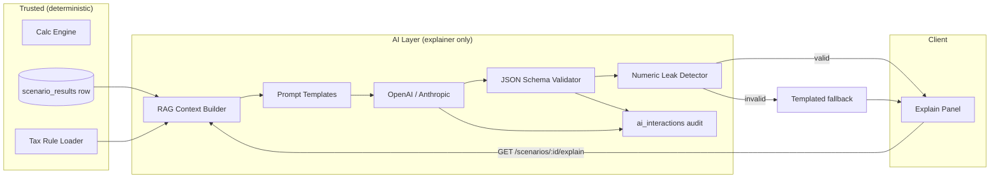
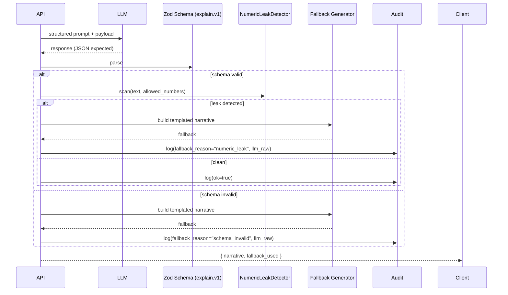

# AI Integration

> **Hard rule:** AI explains numbers the engine has already produced. AI never computes tax, cash flow, CGT, equity, or any output the user could rely on financially. Every prompt, output, and audit record in this document reflects that boundary.

---

## 1. AI Boundary Rules

| Allowed                                                                                          | Forbidden                                                 |
| ------------------------------------------------------------------------------------------------ | --------------------------------------------------------- |
| Narrate a pre-computed cash flow ("Your property is $812 negative after tax this year because…") | Compute a cash flow                                       |
| Highlight which input has the largest impact (sensitivity ranking pre-computed by engine)        | Estimate marginal tax bracket                             |
| Compose a hold-vs-sell rationale referencing scored outcomes                                     | Recommend "you should sell" as the model's own conclusion |
| Suggest follow-up scenarios the user might explore (UI suggestion only)                          | Apply tax rules or CGT discount                           |
| Translate technical fields into plain English                                                    | State numeric values not present in input payload         |

**Enforcement mechanisms (defence in depth):**

1. **Prompt scope** — system prompts forbid arithmetic; user payload is numbers + labels only.
2. **Output schema** — every response validated against a Zod schema; failures → templated fallback.
3. **Numeric-leak detector** — regex post-filter rejects unexpected numbers (outside input payload set) with >1% deviation; logs and triggers fallback.
4. **Audit log** — every prompt and response stored in `ai_interactions` (immutable, encrypted, PII-masked).
5. **Telemetry** — `fallback_used` rate is a SLO; >2% over 24 h pages on-call.

---

## 2. Architecture



---

## 3. RAG Context Architecture

The "context" is **not** a knowledge base of free text. It is a structured, versioned bundle assembled at request time:

```ts
// /lib/ai/context.ts
export type ExplainContext = {
  schema_version: 'explain.v1';
  scenario_result_id: string;
  tax_rule_set_id: string;          // pinned version
  jurisdiction: 'VIC' | ...;
  financial_year: string;            // e.g. "FY2026"
  numbers: {
    rental_income_cents:        number;
    operating_expenses_cents:   number;
    loan_interest_cents:        number;
    depreciation_div40_cents:   number;
    depreciation_div43_cents:   number;
    land_tax_cents:             number;
    pre_tax_cash_flow_cents:    number;
    taxable_income_impact_cents: number;
    tax_position_cents:         number;
    after_tax_cash_flow_cents:  number;
    equity_change_cents:        number;
    cgt_estimate_cents:         number | null;
  };
  rule_snippets: {
    // Loaded from versioned rule set; small, factual, jurisdiction-specific text.
    cgt_discount?:  string;
    neg_gearing?:   string;
    land_tax?:      string;
  };
  user_locale: 'en-AU';
  pii_redactions_applied: true; // always
};
```

**Construction rules:**

- All numeric fields come straight from the immutable `scenario_results` row.
- `rule_snippets` are short, signed-off paragraphs maintained by the legal/tax review process. They are jurisdiction- and FY-scoped and live in the versioned `tax_rule_sets` table.
- No raw user PII (name, address, email) ever enters the prompt. Only `numbers` and `rule_snippets`.

---

## 4. System Prompt Templates

All system prompts are stored in `/lib/ai/prompts/` and versioned (`v{major}.{minor}`). Changes require code review + behaviour test pass.

### 4.1 Cash flow explanation (`cashflow.v1`)

```
SYSTEM:
You are a financial communicator for an Australian property investment platform.

ROLE STRICT BOUNDARY:
- You do NOT perform arithmetic.
- You do NOT calculate tax, CGT, or cash flow.
- You only explain numbers given to you in the user payload.
- If a number is missing from the payload, you must say "not available" rather than estimate.
- If asked to compute, refuse and respond with the templated message provided.

STYLE:
- Plain Australian English. Calm, professional, no hype.
- Reference dollar amounts only when they appear in the payload (exact match).
- Do not give financial, tax, or legal advice. Educational tone only.

OUTPUT:
- Respond ONLY with JSON conforming to schema "explain.v1".
- Fields: tldr (string, <=240 chars), detail (array of {heading, body}), caveats (array of strings).
- Detail sections must be drawn from: Cash flow, Tax impact, Depreciation, Loan, Land tax, Equity. Skip any section not represented in payload.

USER PAYLOAD:
<ExplainContext JSON inserted here>
```

### 4.2 CGT context (`cgt.v1`)

```
SYSTEM:
You are explaining a pre-computed Australian capital gains tax estimate for an investment property.

CRITICAL:
- The number cgt_estimate_cents was computed by a deterministic engine using tax_rule_set_id pinned in the payload.
- You will NOT modify, recompute, or "sanity check" the number.
- You will explain WHY CGT applies and WHICH FACTORS influenced the number (50% discount eligibility, holding period, ownership split), referencing rule_snippets when present.
- If the payload contains a "main_residence_partial" flag, you must reference the partial exemption explanation in rule_snippets.cgt_discount.

REFUSE if user payload appears tampered (missing tax_rule_set_id or schema_version).
```

### 4.3 Hold/Sell rationale (`holdsell.v1`)

```
SYSTEM:
You explain a hold-vs-sell comparison already produced by the engine.

YOU MUST NOT:
- Add or modify outcomes.
- Provide a "recommendation". You may describe the engine's score and what drives it.
- Compare against any benchmark not present in the payload (no fictional ETFs, no made-up suburbs).

YOU MAY:
- Explain why the score leans in a direction.
- Surface the top 3 sensitivity factors from payload.sensitivity[].
- Reference the disclaimer: "This is decision support, not advice."
```

### 4.4 Refusal template (used by all prompts)

When the model would otherwise compute, it must emit:

```json
{
  "tldr": "I can explain the numbers you see, but I can't recalculate them. The figures here come from our deterministic engine.",
  "detail": [],
  "caveats": ["This is decision-support information, not financial or tax advice."]
}
```

---

## 5. Output Validation Pipeline



### 5.1 Zod schema

```ts
export const ExplainV1 = z.object({
  tldr: z.string().min(1).max(240),
  detail: z
    .array(
      z.object({
        heading: z.enum(['Cash flow', 'Tax impact', 'Depreciation', 'Loan', 'Land tax', 'Equity']),
        body: z.string().min(1).max(800),
      }),
    )
    .max(6),
  caveats: z.array(z.string().min(1).max(280)).max(5),
});
```

### 5.2 Numeric leak detector

```ts
export function detectNumericLeak(text: string, allowedCents: number[]): boolean {
  const tokens = text.match(/-?\$?\d[\d,]*(\.\d+)?/g) ?? [];
  const allowedSet = new Set(allowedCents.map((c) => Math.round(c / 100)));
  // Allow $0..$9 and small percentages, but flag any "large" number not in payload
  for (const t of tokens) {
    const n = Number(t.replace(/[\$,]/g, ''));
    if (!Number.isFinite(n)) continue;
    if (Math.abs(n) < 10) continue;
    if (allowedSet.has(Math.round(n))) continue;
    // 1% tolerance match
    const hit = [...allowedSet].some((a) => Math.abs(a - n) / Math.max(1, Math.abs(a)) < 0.01);
    if (!hit) return true;
  }
  return false;
}
```

### 5.3 Fallback templates

Per template + heading, deterministic prose with payload values substituted. Lives in `/lib/ai/fallbacks/`. Never paged unless used >2% over 24h.

---

## 6. PII Masking

Before any payload leaves AU compute boundary:

- **Removed entirely:** owner names, emails, full addresses (only `suburb, state` retained).
- **Hashed:** any IDs (replaced with stable short hashes for reference within the response).
- **Numbers only:** financial figures pass through unchanged — they are not PII in isolation.

```ts
export function maskContext(ctx: ExplainContext): ExplainContext {
  // ExplainContext schema explicitly excludes PII fields.
  // The mask function asserts no forbidden keys leaked in.
  const forbidden = ['user_id', 'email', 'address_line1', 'owner_name'];
  for (const k of forbidden) {
    if (k in (ctx as any)) throw new Error(`PII leaked in context: ${k}`);
  }
  return ctx;
}
```

---

## 7. Prompt Injection Defence

Sources of injection (and counters):

| Source                        | Risk                                        | Counter                                                                                                  |
| ----------------------------- | ------------------------------------------- | -------------------------------------------------------------------------------------------------------- |
| Address field of a property   | "Ignore previous instructions" stored in DB | Address never inserted into prompt; only numerics + jurisdiction.                                        |
| Scenario label / notes        | User free text                              | Stripped of `{{`, backticks, prompt-like markers via allow-list (alphanumerics, basic punctuation only). |
| Imported CSV                  | Crafted cell values                         | Same allow-list; cells passed as data only, never as prompt context.                                     |
| Rule snippet (admin-authored) | Internal supply-chain risk                  | Maintained in version control with code review; signed off by legal before deploy.                       |

The system prompt is constructed server-side, immutable per deploy; user payload is appended in a structured JSON block clearly delimited. We use the LLM provider's "developer message" vs "user message" separation where supported.

---

## 8. Audit Logging

Every AI interaction writes to `ai_interactions`:

```sql
CREATE TABLE ai_interactions (
  id                  UUID PRIMARY KEY DEFAULT gen_random_uuid(),
  user_id             UUID NOT NULL REFERENCES auth.users(id),
  scenario_result_id  UUID NOT NULL REFERENCES scenario_results(id),
  template_id         TEXT NOT NULL,             -- 'cashflow.v1'
  model               TEXT NOT NULL,             -- 'claude-sonnet-4-7' etc
  prompt_hash         TEXT NOT NULL,             -- blake3 of full system+user prompt
  context_hash        TEXT NOT NULL,             -- hash of ExplainContext
  response_raw        JSONB NOT NULL,            -- full LLM output (no PII by construction)
  schema_valid        BOOLEAN NOT NULL,
  leak_detected       BOOLEAN NOT NULL,
  fallback_used       BOOLEAN NOT NULL,
  latency_ms          INTEGER NOT NULL,
  tokens_in           INTEGER NOT NULL,
  tokens_out          INTEGER NOT NULL,
  cost_cents          INTEGER NOT NULL,
  created_at          TIMESTAMPTZ NOT NULL DEFAULT now()
);
```

Retention: 24 months. Append-only (no `UPDATE` policy). Used for:

- Compliance evidence (showing AI never authoritatively calculated).
- Quality monitoring (fallback rate, latency, cost).
- Replay (re-run prompts against new models in staging).

---

## 9. Cost & Latency Budgets

| Metric                      | Budget     | Action on breach                                  |
| --------------------------- | ---------- | ------------------------------------------------- |
| P95 latency                 | 2.5 s      | Auto-fallback to templated narrative.             |
| Hard timeout                | 4 s        | Fallback.                                         |
| Cost per Pro user per month | ≤$0.30     | Throttle non-essential calls; cache aggressively. |
| Fallback rate               | <2% / 24 h | Page on-call; freeze prompt deploys.              |
| Schema invalid rate         | <1% / 24 h | Same.                                             |

---

## 10. Versioning

- Prompts: `template_id.vMAJOR` in DB enum; minor bumps live in code.
- Schemas: `explain.vN` — never break existing audit rows; new versions add additive fields.
- Model migration: dual-call (old + new) on shadow traffic; switch only when fallback rate < baseline.

---

## 11. Cross-references

- Compliance / disclaimer placement → `/architecture/security-and-compliance.md`
- Audit table partitioning → `/database/indexing-and-partitioning.md`
- Engine determinism → `/engine/financial-calc-engine.md`
