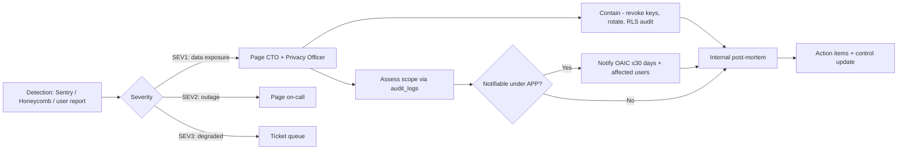

# Security & Compliance

> OWASP-aligned fintech security posture, encryption strategy, RLS architecture, disclaimers, and Australian compliance obligations (APP, ATO data handling, Victorian privacy).

---

## 1. OWASP Top 10 — SaaS Fintech Mitigations

| Risk                                   | Mitigation                                                                                                                                                                                                                                   |
| -------------------------------------- | -------------------------------------------------------------------------------------------------------------------------------------------------------------------------------------------------------------------------------------------- |
| **A01 Broken Access Control**          | Every table has RLS enabled; `service_role` reserved for system code paths; auth middleware enforces tier + AAL on every mutation; resource-not-found responses are tenant-blind (same shape whether record exists in another tenant).       |
| **A02 Cryptographic Failures**         | TLS 1.3 only; AES-256 at rest (Supabase managed); secrets in Vercel/Supabase env vaults; no secrets in client bundles; financial PDFs encrypted at rest in private buckets.                                                                  |
| **A03 Injection**                      | Parametrised queries (Supabase client); Zod-validated inputs at API boundary; CSV importer treats cells as data, never code (formulas neutralised); HTML output sanitised via React (no `dangerouslySetInnerHTML` allowed in calc surfaces). |
| **A04 Insecure Design**                | Calc engine is pure functions, no I/O; immutable audit trail; tax rules versioned; reproducibility verified in CI.                                                                                                                           |
| **A05 Security Misconfiguration**      | IaC for Supabase + Vercel; tight CSP, HSTS, COOP/COEP; default-deny RLS; staging mirrors prod.                                                                                                                                               |
| **A06 Vulnerable Components**          | Renovate bot; `npm audit` blocking on `high`; SBOM published per release; lockfiles enforced.                                                                                                                                                |
| **A07 Identification & Auth Failures** | Supabase Auth with MFA (TOTP); rate-limited login (5/min/IP, exponential backoff); session rotation; password breach check via HIBP on signup.                                                                                               |
| **A08 Software/Data Integrity**        | Signed deploys; SRI on third-party scripts; webhook signature verification (Stripe); idempotency keys on writes.                                                                                                                             |
| **A09 Logging & Monitoring Failures**  | OpenTelemetry traces; Sentry for errors; `audit_logs` for security-relevant events; alerting on RLS denials >threshold.                                                                                                                      |
| **A10 SSRF**                           | Allow-listed outbound destinations; no user-supplied URLs fetched server-side.                                                                                                                                                               |

---

## 2. Encryption Strategy

### 2.1 In transit

- TLS 1.3 minimum. HSTS `max-age=63072000; includeSubDomains; preload`.
- mTLS for Supabase → Edge Function ↔ Postgres (Supabase-managed).
- LLM provider calls over TLS 1.3 with pinned hostnames.

### 2.2 At rest

- Supabase Postgres: AES-256 (cloud-managed). PITR snapshots encrypted with separate KMS keys.
- Supabase Storage: server-side encryption; presigned URLs only, TTL ≤ 15 min.
- Backups: AU region, encrypted, 30-day retention.

### 2.3 Application-level

- Sensitive fields (`tfn`, if ever stored — Phase 3 only) encrypted with `pgcrypto` (`pgp_sym_encrypt`) using key from Supabase Vault. Decryption only in trusted server contexts.
- AI interaction `response_raw` JSONB is encrypted at column level for the long-tail audit table.

### 2.4 RLS as security boundary

- RLS policies are the _primary_ tenant isolation mechanism; defence in depth only — application code also re-checks `user_id` ownership on writes.

---

## 3. RLS Policy Architecture

Principles:

1. **Default deny** — `FORCE ROW LEVEL SECURITY` on every multi-tenant table.
2. **`auth.uid()` is canonical** — most policies key on it directly.
3. **Org membership** — checked via `user_org_membership` join with role filter.
4. **Append-only tables** (`audit_logs`, `scenario_results`, `ai_interactions`) — no UPDATE/DELETE policy for normal roles.

Example policy (full set in `/database/rls-policies.sql`):

```sql
CREATE POLICY "properties_select_own_or_org" ON properties
  FOR SELECT TO authenticated USING (
    user_id = auth.uid()
    OR EXISTS (
      SELECT 1 FROM user_org_membership uom
      WHERE uom.user_id = auth.uid()
        AND uom.org_id  = properties.org_id
        AND uom.role IN ('owner','accountant','viewer','admin')
    )
  );
```

### Roles

| Role           | Read                     | Write              | Delete        | Notes                                |
| -------------- | ------------------------ | ------------------ | ------------- | ------------------------------------ |
| `owner`        | Own + org                | Own + org          | Own           | Default for account creator          |
| `viewer`       | Org (read-only)          | —                  | —             | Spouse / observer                    |
| `accountant`   | Org (read + comment)     | Comments + reports | —             | Channel role                         |
| `admin`        | Org                      | Org                | Org           | Org-level admin (not platform admin) |
| `service_role` | All (limited code paths) | All (limited)      | All (limited) | Webhooks, workers, migrations        |

Platform engineers never use `service_role` directly in user-facing routes. Use lint rule blocking import outside `/server/system/`.

---

## 4. Disclaimer Placement

Mandatory disclaimer text (canonical, English-AU):

> _EquityLens provides decision-support information only. Outputs are not financial product advice, tax advice, or legal advice within the meaning of the Corporations Act 2001 (Cth) or the Tax Agent Services Act 2009 (Cth). All estimates depend on user-supplied inputs and versioned Australian tax rules current at the time of calculation. Always consult a registered tax agent or licensed financial adviser before acting._

| Surface              | Placement                                                                                 |
| -------------------- | ----------------------------------------------------------------------------------------- |
| Every PDF report     | Footer on every page + "About these numbers" page at end.                                 |
| Every CSV export     | Header comment row (`# Disclaimer: …`) + companion `disclaimer.txt` in the export bundle. |
| Dashboard            | Persistent low-emphasis link in footer; modal on first sign-in.                           |
| Scenario Lab results | Inline subdued box below outputs.                                                         |
| AI explanation panel | Always present as a `caveat`.                                                             |
| Pricing page         | Below CTA.                                                                                |
| Marketing site       | Footer + dedicated `/disclaimers` page.                                                   |

Legal sign-off: any change to disclaimer text requires `legal-review` GitHub label and version bump in `/lib/legal/disclaimers.ts`.

---

## 5. Data Deletion Workflows

### 5.1 Soft delete

- User triggers from `/settings/account/delete`.
- 14-day grace; account is read-only; daily warning email.
- User can cancel deletion any time within window.

### 5.2 Hard delete

- After 14 days, background job:
  1. Snapshot of `properties`, `loans`, `scenarios` exported to user as encrypted ZIP (one-time signed URL, 7-day TTL).
  2. Delete from app tables.
  3. Anonymise `audit_logs`: `user_id` → blake3 hash; `actor_email` redacted to `redacted@`.
  4. Delete from Supabase Auth.
  5. Purge Stripe customer (or anonymise per Stripe retention).
- Workflow itself is audit-logged with deletion job ID, retained 7 years.

### 5.3 Backup expiry

- PITR retains 30 days by default; deleted account data ages out automatically.
- Manual backup purge only on regulatory order; documented in incident log.

---

## 6. Australian Compliance Checklist

### 6.1 Australian Privacy Principles (APP)

| APP    | Obligation                            | Implementation                                                                                                                 |
| ------ | ------------------------------------- | ------------------------------------------------------------------------------------------------------------------------------ |
| APP 1  | Open & transparent privacy management | `/privacy` page, public policy, contact for Privacy Officer.                                                                   |
| APP 3  | Collection of solicited information   | Onboarding collects only what calc engine needs; QS report optional.                                                           |
| APP 5  | Notification of collection            | Inline microcopy at each form; full notice in privacy policy.                                                                  |
| APP 6  | Use & disclosure                      | Data not shared with third parties beyond infrastructure providers (Supabase, Vercel, Stripe, LLM, Sentry) — listed in policy. |
| APP 8  | Cross-border disclosure               | LLM calls minimise data (numbers + jurisdiction only, no PII). Disclosed in policy with country listing.                       |
| APP 11 | Security of personal information      | This document; encryption, RLS, MFA, audit, deletion workflows.                                                                |
| APP 12 | Access to personal information        | Self-service export from `/settings/data`.                                                                                     |
| APP 13 | Correction                            | User can edit any property/loan/income/expense; for legacy data, support email.                                                |

### 6.2 ATO data alignment

- CSV exports use ATO field naming where applicable (`gross_rent`, `interest_on_loans`, `capital_works_div_43`, `decline_in_value_div_40`).
- Tax rule sets reference ATO publications (TR/IT/Div numbers cited).
- We do not lodge returns; we are decision support and ATO-format export.

### 6.3 Victorian privacy (Privacy and Data Protection Act 2014 / 2024 amendments)

- AU-only residency in Sydney region.
- Notifiable Data Breach (NDB) playbook documented; OAIC-aligned timeline (≤30 days assessment).
- Data Breach Response runbook in `/operations/`.

### 6.4 Tax Agent Services Act (TASA)

- We are **not** a registered tax agent.
- Output language never says "your tax return", always "estimated tax position".
- AI prompts contain explicit refusal-to-advise clause.

### 6.5 ASIC / AFSL

- We are **not** providing financial product advice.
- No model portfolios, no recommendations to buy/sell specific securities or properties.
- Hold/Sell engine outputs decision support metrics, not advice.

### 6.6 Anti-Money-Laundering (AML)

- Not currently a reporting entity (no client money handled, no investment products sold).
- If we add features (e.g. broker referrals with commission), full AML/CTF review required pre-launch.

---

## 7. Vulnerability Management

- Monthly internal scan (Snyk + `npm audit` + `pg_audit`).
- Quarterly third-party penetration test.
- Annual SOC 2 readiness assessment (Phase 2); full SOC 2 Type II audit by year 3.
- Bug bounty (responsible disclosure) public page from Phase 2.

---

## 8. Incident Response



Runbook in `/operations/incident-runbook.md` (separate doc; references this).

---

## 9. Cross-references

- RLS policy code → `/database/rls-policies.sql`
- AI PII rules → `/architecture/ai-integration.md` §6
- Audit log partitioning → `/database/indexing-and-partitioning.md`
- Deployment safety → `/operations/deployment-checklist.md`
