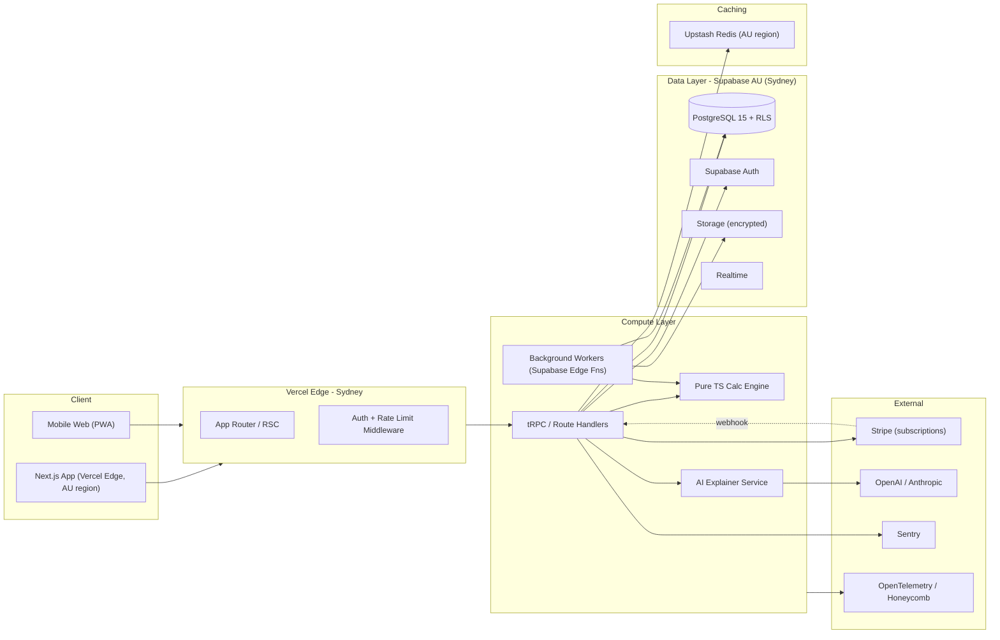
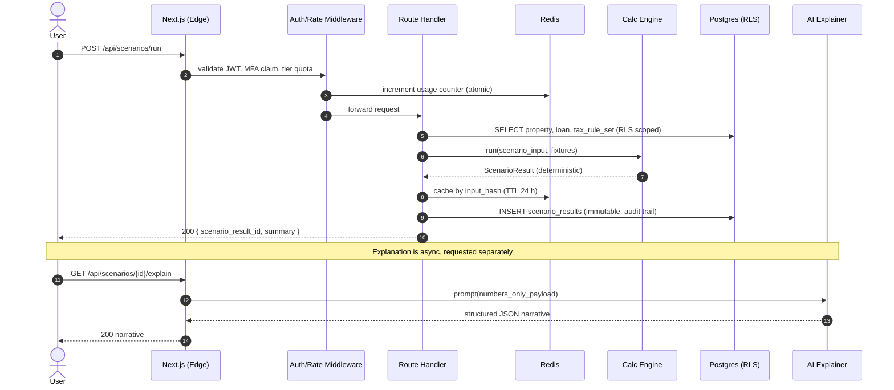
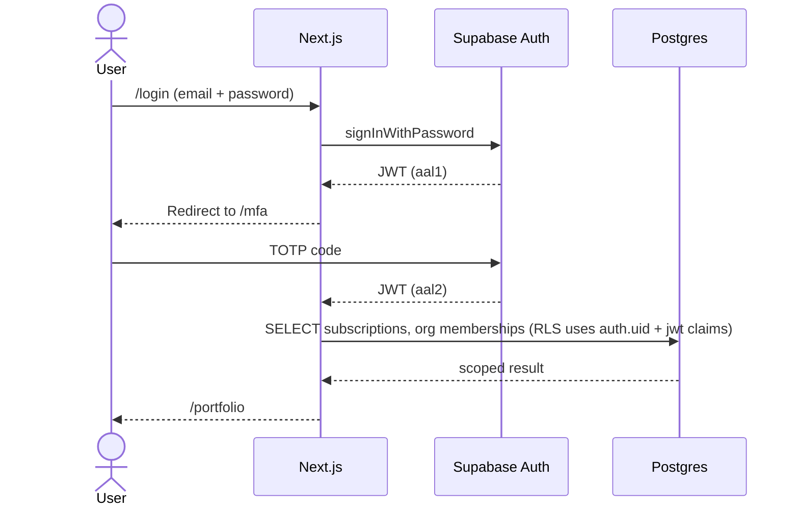
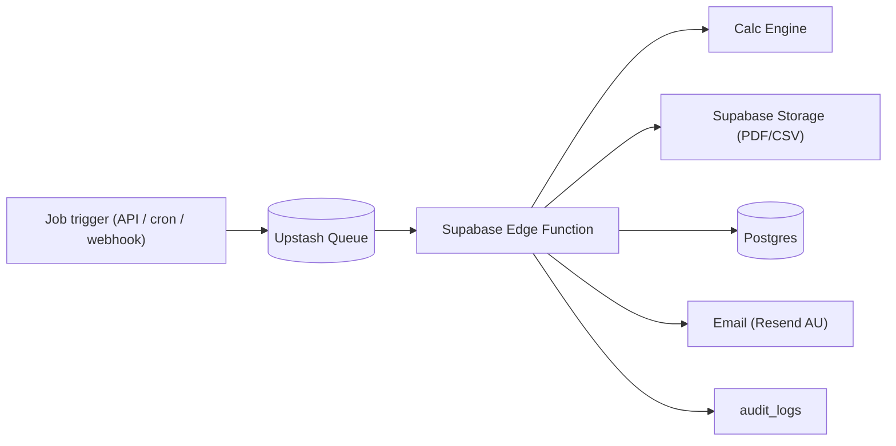

# System Architecture

> High-level architecture, service boundaries, data flow, auth, caching, scalability, and AU data-residency constraints.

---

## 1. Architecture Overview

---

## 2. Service Boundaries

| Service                 | Purpose                                                   | Lives in                         | Stateless?            |
| ----------------------- | --------------------------------------------------------- | -------------------------------- | --------------------- |
| **Web app (Next.js)**   | UI, RSC, route handlers                                   | Vercel Edge (AU)                 | Yes                   |
| **Calc Engine**         | Pure deterministic TS module                              | Imported into Edge/Node runtime  | Yes                   |
| **AI Explainer**        | RAG over numbers → narration                              | Edge runtime, calls external LLM | Yes                   |
| **Background Workers**  | PDF gen, scheduled reports, batch recalcs                 | Supabase Edge Functions          | Yes (idempotent jobs) |
| **Postgres (Supabase)** | System of record                                          | Supabase AU (Sydney)             | No                    |
| **Storage**             | PDF / CSV artefacts, QS PDFs                              | Supabase Storage                 | No                    |
| **Redis (Upstash)**     | Rate limit counters, idempotency keys, AI narrative cache | Upstash AU                       | No (ephemeral)        |

**Rule:** business logic for money lives only in the Calc Engine. No "convenience math" in API handlers or UI.

---

## 3. Data Flow — Scenario Run

---

## 4. Authentication & Authorisation

### 4.1 Stack

- Supabase Auth (email/password, OAuth Phase 2, SSO Phase 3).
- TOTP MFA mandatory for Pro / Professional; optional for Free.
- JWT contains `sub`, `email`, `role`, `aal` (assurance level), `org_ids[]`.
- AAL2 (MFA-verified) required for: data exports, billing changes, scenario writes on Professional.

### 4.2 Flow

### 4.3 RLS Enforcement Points

- **Every** table has RLS enabled. No `service_role` access in user-facing code paths.
- `service_role` reserved for: Stripe webhook handler, background workers, migrations.
- `auth.uid()` and `auth.jwt() -> 'org_ids'` used in policy expressions. See `/database/rls-policies.sql`.

### 4.4 Session Management

- Access token TTL: 60 minutes. Refresh token: 7 days, rotated on use.
- Logout clears refresh + access tokens + invalidates server cookies.
- Idle timeout: 30 min in browser tab without activity → silent refresh attempt; if refresh fails, hard logout.

---

## 5. Caching Strategy

| Layer           | What                                                     | TTL                           | Invalidation                          |
| --------------- | -------------------------------------------------------- | ----------------------------- | ------------------------------------- |
| Vercel CDN      | Public marketing pages, OG images                        | 1 h                           | Deploy invalidates                    |
| RSC cache       | Static dashboard shells                                  | 30 s (stale-while-revalidate) | On mutation, `revalidatePath`         |
| Redis (Upstash) | Scenario result by `input_hash`                          | 24 h                          | Property/loan mutation → purge by tag |
| Redis           | AI narrative by `(scenario_result_id, template_version)` | 7 d                           | Tax rule version change purges        |
| Postgres        | Materialised view for portfolio metrics                  | 5 min                         | Triggered refresh on writes           |

**Rule:** never cache anything across users. All cache keys include `user_id` or `org_id`.

---

## 6. Background Jobs

Job types: `pdf.render`, `csv.export`, `scheduled_report.deliver`, `batch_recalc.tax_rule_change`, `account.hard_delete`.

All jobs are idempotent (`job_id` UUID, dedupe via Redis `SETNX`). Failures retry with exponential backoff (1m, 5m, 30m); 4th failure → DLQ + Sentry alert.

---

## 7. Scalability & Failover

| Concern             | Approach                                                                                        |
| ------------------- | ----------------------------------------------------------------------------------------------- |
| Read scale          | RLS-safe Postgres read replicas via Supabase (Phase 2); cache hot portfolio aggregates.         |
| Write scale         | Calc Engine is stateless; horizontal Edge scaling. Postgres connection via Supabase pgbouncer.  |
| Hot path latency    | RSC + Edge → P95 dashboard load <800 ms (AU users).                                             |
| Cold path (PDF gen) | Async; SLO P95 <30 s.                                                                           |
| LLM dependency      | Hard 4 s timeout; templated fallback narrative. AI failure is **never** a user-visible blocker. |
| Region failover     | Supabase Sydney primary; Melbourne standby (Phase 2). RPO 5 min via PITR.                       |
| Stripe outage       | Webhooks queue locally; entitlements continue based on last-known tier with 7-day grace.        |

### Capacity targets (year-1)

- 10k MAU, 50k properties, 500k scenario runs/month.
- DB at <40% CPU. Hot read P99 <50 ms. Engine compute <60 ms per scenario.

---

## 8. AU Data Residency

- All Supabase resources provisioned in `ap-southeast-2` (Sydney).
- Vercel Functions pinned to `syd1`.
- Upstash region `ap-southeast-2`.
- Storage buckets AU-only.
- LLM calls: OpenAI / Anthropic regions configured for Australia where supported; otherwise data minimised (numbers only, no PII) before egress. See `/architecture/ai-integration.md` §5.
- No data egress to US/EU regions for primary user records.

---

## 9. Environments

| Env     | URL                        | Branch     | DB                         | Tax rules     | Stripe |
| ------- | -------------------------- | ---------- | -------------------------- | ------------- | ------ |
| Dev     | `dev.propertywealth.local` | feature/\* | seeded local               | latest staged | test   |
| Staging | `staging.equitylens.app`   | `staging`  | clone of prod (anonymised) | staged        | test   |
| Prod    | `app.equitylens.com.au`    | `main`     | live                       | published     | live   |

Promotion: dev → staging on PR merge; staging → prod via manual gated deploy. See `/operations/ci-cd-pipeline.md`.

---

## 10. Cross-references

- API contracts → `/architecture/api-contracts.md`
- Engine internals → `/engine/financial-calc-engine.md`
- DB schema → `/database/schema.sql`
- Security and compliance → `/architecture/security-and-compliance.md`
