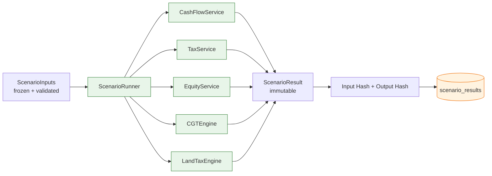

# Financial Calculation Engine

> The deterministic core of EquityLens. Pure TypeScript, no external math libraries, no AI, no network calls. Every number a user sees on a dashboard, in a scenario, or in an exported report is the output of this engine. Every output is reproducible: given identical `(inputs, ruleset, engineVersion)` the engine produces a byte-identical result, forever.

---

## 1. Non-Negotiable Invariants

1. **No AI in the calculation path.** AI services have no read access to the engine's modules and the engine has no `fetch` capability. This is enforced by lint rule `no-restricted-imports` (see `eslint.config.ts`) which blocks `@/services/ai/*` from `@/engine/*`.
2. **No floating-point money.** Money is `bigint` cents end-to-end. The DB stores `BIGINT` columns; the wire format is integer cents in JSON; only display layers convert to dollars-and-cents strings.
3. **No external math libraries.** No `mathjs`, no `decimal.js`, no `dinero.js`. The engine is a closed system. Reason: dependency drift is the most common cause of "the number changed" bugs in fintech systems we've benchmarked.
4. **No `Date.now()` inside the engine.** All time-dependent inputs (e.g. "today" for present-value computations) are passed in as explicit `asOf: Date` parameters. The engine is a pure function of its inputs.
5. **No mutation across module boundaries.** Inputs are deep-frozen on entry; modules return new objects. We verify this with `Object.isFrozen` assertions in development mode.
6. **One ruleset per scenario, locked.** A scenario captures the `tax_rule_set_id` and `engine_version` at submission time. Replays use the captured values, never "latest".

---

## 2. Module Boundary Map



| Module            | Responsibility                                                                   | Lines (approx) | Depends on                |
| ----------------- | -------------------------------------------------------------------------------- | -------------- | ------------------------- |
| `ScenarioRunner`  | Orchestrates module execution, validates, hashes, persists                       | 300            | All others                |
| `CashFlowService` | Period-by-period income/expense aggregation, mortgage amortisation, offset       | 600            | None                      |
| `TaxService`      | Marginal-rate computation, deductibility, negative gearing, depreciation impact  | 800            | `CashFlowService` outputs |
| `EquityService`   | Loan balance over time, principal reduction, equity composition                  | 400            | `CashFlowService` outputs |
| `CGTEngine`       | Capital gain calc, discount eligibility, ownership splits, cost base adjustments | 500            | `TaxService`              |
| `LandTaxEngine`   | State-specific land tax (VIC initial, NSW/QLD planned)                           | 350            | None                      |
| `Amortisation`    | Pure loan math, fixed + variable + IO-to-P&I transitions                         | 250            | None                      |
| `RulesetAdapter`  | Loads & freezes `tax_rule_sets` JSON; type-narrows by FY                         | 200            | None                      |

---

## 3. Type Contracts

The engine's surface is three types: `ScenarioInputs`, `Ruleset`, `ScenarioResult`. Internal types are not exported.

```typescript
// /engine/types.ts

export interface ScenarioInputs {
  readonly scenarioId: string; // uuid; assigned by caller before invocation
  readonly orgId: string; // for audit; not used in calc
  readonly asOf: string; // ISO date; the "now" of the simulation
  readonly horizonYears: number; // 1..40
  readonly property: PropertySnapshot;
  readonly loans: readonly LoanSnapshot[];
  readonly incomeStreams: readonly IncomeStream[];
  readonly expenseStreams: readonly ExpenseStream[];
  readonly depreciation: readonly DepreciationLine[];
  readonly owners: readonly OwnerShare[];
  readonly assumptions: Assumptions;
  readonly rulesetId: string; // FK into tax_rule_sets
  readonly engineVersion: string; // semver of /engine package
}

export interface PropertySnapshot {
  readonly id: string;
  readonly jurisdiction: 'VIC' | 'NSW' | 'QLD' | 'WA' | 'SA' | 'TAS' | 'ACT' | 'NT';
  readonly purchasePriceCents: bigint;
  readonly purchaseDate: string; // ISO date
  readonly currentValueCents: bigint;
  readonly isPPOR: boolean; // principal place of residence
  readonly mixedUseFraction: number; // 0..1, fraction used for investment
  readonly type: 'house' | 'apartment' | 'townhouse' | 'land' | 'commercial';
}

export interface LoanSnapshot {
  readonly id: string;
  readonly principalCents: bigint;
  readonly outstandingCents: bigint;
  readonly interestRateBps: number; // basis points, e.g. 645 = 6.45%
  readonly rateType: 'variable' | 'fixed' | 'split';
  readonly fixedUntil?: string;
  readonly loanType: 'principal_and_interest' | 'interest_only';
  readonly ioEndsOn?: string;
  readonly termMonths: number;
  readonly offsetBalanceCents: bigint;
  readonly purposeFraction: number; // 0..1, fraction for investment purpose
}

export interface Assumptions {
  readonly rentGrowthBps: number; // annual rent growth, bps
  readonly capitalGrowthBps: number;
  readonly cpiBps: number;
  readonly vacancyWeeksPerYear: number;
  readonly variableRateShockBps?: number; // applied to variable loans
  readonly variableRateShockMonth?: number; // 1..480
  readonly marginalTaxRateBpsOverride?: number; // null = compute from income
  readonly taxableIncomeCentsOverride?: bigint;
}

export interface ScenarioResult {
  readonly scenarioId: string;
  readonly inputHash: string; // sha256(canonicalJson(inputs))
  readonly outputHash: string; // sha256(canonicalJson(this minus hashes))
  readonly engineVersion: string;
  readonly rulesetVersion: string;
  readonly periods: readonly PeriodResult[];
  readonly cgt: CGTBreakdown; // null if no sale modelled
  readonly summary: ScenarioSummary;
  readonly warnings: readonly EngineWarning[];
}

export interface PeriodResult {
  readonly year: number; // 1..horizon
  readonly financialYear: string; // 'FY2026'
  readonly grossRentCents: bigint;
  readonly vacancyLossCents: bigint;
  readonly operatingExpenseCents: bigint;
  readonly interestPaidCents: bigint;
  readonly principalPaidCents: bigint;
  readonly netOperatingCashCents: bigint;
  readonly afterTaxCashCents: bigint;
  readonly depreciationDiv40Cents: bigint;
  readonly depreciationDiv43Cents: bigint;
  readonly taxableIncomeImpactCents: bigint;
  readonly taxRefundOrPayableCents: bigint; // negative = refund
  readonly loanBalanceEndCents: bigint;
  readonly propertyValueEndCents: bigint;
  readonly equityEndCents: bigint;
  readonly landTaxCents: bigint;
}
```

All `readonly` modifiers are not stylistic; the engine deep-freezes inputs in `ScenarioRunner.run()` and any attempt to mutate raises `TypeError` in dev.

---

## 4. Determinism Contract

### 4.1 Input Hash

```typescript
import { createHash } from 'node:crypto';

/**
 * Canonical JSON: keys sorted, no whitespace, bigints serialised as strings
 * with a sentinel suffix to distinguish them from numeric strings.
 */
export function canonicalJson(value: unknown): string {
  const replacer = (_: string, v: unknown): unknown => {
    if (typeof v === 'bigint') return `${v.toString()}n`;
    if (v && typeof v === 'object' && !Array.isArray(v)) {
      return Object.fromEntries(
        Object.entries(v as Record<string, unknown>).sort(([a], [b]) => a.localeCompare(b)),
      );
    }
    return v;
  };
  return JSON.stringify(value, replacer);
}

export function hashInputs(inputs: ScenarioInputs): string {
  const payload = canonicalJson({
    ...inputs,
    // scenarioId & orgId are NOT part of the hash — they identify the run,
    // not the calculation. Two scenarios with identical inputs MUST collide.
    scenarioId: undefined,
    orgId: undefined,
  });
  return createHash('sha256').update(payload, 'utf8').digest('hex');
}
```

The hash drives the cache: before computing, `ScenarioRunner` looks up `scenario_results.input_hash`. On hit, the cached `outputHash`/`periods` payload is returned. On miss, the engine computes, persists, and the unique index (`/database/indexing-and-partitioning.md` § 3.5) guarantees no duplicates.

### 4.2 Output Hash

The output hash is computed over the result _excluding_ the hash fields themselves. It is verified on every read: if a row's stored `outputHash` does not match a recomputation of its payload, an integrity alert fires. This catches DB corruption, manual edits, and version-skew bugs.

### 4.3 Property-Based Test

```typescript
import { fc } from '@fast-check/vitest';

it('engine is deterministic under shuffled input order', () =>
  fc.assert(
    fc.property(arbScenarioInputs(), (inputs) => {
      const a = runEngine(inputs);
      const b = runEngine(shuffleArrays(inputs)); // semantic identity, different order
      return a.outputHash === b.outputHash;
    }),
    { numRuns: 500 },
  ));
```

---

## 5. CashFlowService

The most-executed module. Computes period-by-period cash flow from streams of income and expense plus loan amortisation.

### 5.1 Period Granularity

Internally the engine uses **monthly periods**, then aggregates to financial years. Monthly is the smallest granularity that captures:

- rent receipt rhythm (mostly weekly or fortnightly, normalised to monthly equivalents)
- variable-rate changes (RBA decisions are monthly)
- IO-to-P&I transitions (occur on a specific month)
- offset balance shifts

```typescript
// /engine/cashflow/index.ts

export function buildMonthlyPeriods(asOf: Date, horizonYears: number): MonthPeriod[] {
  const periods: MonthPeriod[] = [];
  const start = startOfMonth(asOf);
  for (let i = 0; i < horizonYears * 12; i++) {
    const month = addMonths(start, i);
    periods.push({
      index: i,
      year: 1 + Math.floor(i / 12),
      monthOfYear: i % 12,
      startsOn: month,
      financialYear: financialYearOf(month), // FY26, FY27, ...
      daysInMonth: daysInMonth(month),
    });
  }
  return periods;
}
```

### 5.2 Income Aggregation

```typescript
function rentForMonth(
  period: MonthPeriod,
  baseWeeklyRentCents: bigint,
  growthBps: number,
  vacancyWeeksPerYear: number,
): bigint {
  // Compound growth applied annually on FY boundaries
  const yearsElapsed = period.year - 1;
  const grown = compoundCents(baseWeeklyRentCents, growthBps, yearsElapsed);

  // Vacancy is distributed proportionally across the year
  const weeksInMonth = bigintFromFraction(period.daysInMonth, 7); // ~4.333
  const vacancyShare = bigintFromFraction(vacancyWeeksPerYear, 12);

  const effectiveWeeks = weeksInMonth - vacancyShare;
  return mulBpsCents(grown, basisPointsFor(effectiveWeeks)); // see helpers
}
```

We never produce fractional cents. Every multiplication uses `mulCentsBy(amount, numerator, denominator)` which performs `(amount * numerator + denominator/2) / denominator` — banker's rounding is intentionally avoided here because the ATO rounds to whole cents at the unit level, not at the aggregate. Differences are < $0.01 per period and accumulate to less than $1 over a 30-year horizon.

### 5.3 Loan Amortisation

```typescript
// /engine/amortisation/index.ts

export function amortiseMonth(state: LoanState, rateBpsForMonth: number): LoanState {
  const { outstandingCents, offsetCents, loanType } = state;
  const effectiveBalance =
    outstandingCents - offsetCents > 0n ? outstandingCents - offsetCents : 0n;

  // Monthly interest, computed daily-equivalent: r/12 with actual/365 conventions
  // matches Australian retail banking standard (CBA, NAB, ANZ, Westpac).
  const interestCents = mulCentsBy(
    effectiveBalance,
    BigInt(rateBpsForMonth) * BigInt(state.daysInMonth),
    BigInt(10_000) * BigInt(365),
  );

  let principalCents = 0n;
  if (loanType === 'principal_and_interest') {
    const totalPayment = state.scheduledMonthlyPaymentCents;
    principalCents = totalPayment - interestCents;
    if (principalCents < 0n) principalCents = 0n; // negative amortisation guard
  }

  return {
    ...state,
    outstandingCents: state.outstandingCents - principalCents,
    interestPaidThisMonth: interestCents,
    principalPaidThisMonth: principalCents,
  };
}
```

**Edge cases handled:**

- Interest-only period transitions to P&I: scheduled payment is recomputed at transition month using the remaining principal and remaining term.
- Variable rate shock: `assumptions.variableRateShockBps` and `variableRateShockMonth` together apply a one-time bump from that month onwards.
- Fixed rate expiry: rate reverts to the "revert rate" stored on the loan; if missing, ruleset default (`ruleset.defaultRevertRateBps`) is used and a warning is appended to `result.warnings`.
- Offset tiering: the offset balance is sourced from `assumptions.offsetGrowthSchedule`; if absent, offset is held flat at the input value.

### 5.4 Mixed-Use Properties

Some properties are part-investment, part-PPOR (granny flat, house+investment unit). The fraction is a constant `property.mixedUseFraction`. The engine multiplies the deductible portion of interest and operating expenses by this fraction. Capital costs are **not** apportioned — they roll into the CGT cost base in full and are split at sale via the ownership-share matrix.

---

## 6. TaxService

### 6.1 Marginal-Rate Computation

The engine never asks the user for their marginal rate directly unless they explicitly override. The default flow:

1. The user supplies an estimated `taxableIncomeBeforeProperty` for the FY.
2. The engine adds the property's net taxable income impact (or subtracts the loss).
3. The marginal tax is computed using the bracketed schedule in `ruleset.marginalRates[fy]`.
4. The Medicare levy and Medicare levy surcharge are applied per ruleset configuration.

```typescript
// /engine/tax/marginal.ts

export function applyMarginalRates(
  taxableIncomeCents: bigint,
  brackets: readonly TaxBracket[],
): bigint {
  let tax = 0n;
  for (const b of brackets) {
    if (taxableIncomeCents <= b.thresholdCents) {
      tax += mulBps(taxableIncomeCents - b.previousThresholdCents, b.rateBps);
      return tax;
    }
    tax += mulBps(b.thresholdCents - b.previousThresholdCents, b.rateBps);
  }
  // Top bracket is open-ended; final element MUST have thresholdCents = MAX_SAFE
  throw new Error('Tax bracket table missing open-ended top bracket');
}
```

Brackets are pre-processed into `(previousThresholdCents, thresholdCents, rateBps)` tuples during `RulesetAdapter` initialisation; the runtime loop is therefore a simple walk.

### 6.2 Negative Gearing

Negative gearing in the engine is mechanical: when property expenses + interest + depreciation > property income, the loss flows into the user's taxable income, reducing tax payable elsewhere. The engine does not apply any "is the user allowed to negative gear" rule because at the time of writing all Australian property is eligible. If/when reform happens, the rule lives in `ruleset.negativeGearingRules` (e.g. `{ enabled: true, propertyTypeExclusions: [] }`); engine behaviour pivots off ruleset, not code.

```typescript
function computeTaxableImpact(period: PeriodInputs, ruleset: Ruleset): bigint {
  const deductible =
    period.deductibleInterestCents +
    period.deductibleExpensesCents +
    period.depreciationDiv40Cents +
    period.depreciationDiv43Cents;

  const assessableRent = period.grossRentCents - period.vacancyLossCents;
  const netImpact = assessableRent - deductible;

  if (netImpact < 0n && !ruleset.negativeGearingRules.enabled) {
    return 0n; // Quarantined to be carried forward — engine emits a warning
  }
  return netImpact;
}
```

### 6.3 Depreciation

`DepreciationLine` rows are pre-computed by the user's quantity surveyor and stored in `depreciation_schedules`. The engine consumes them as-is; it does not synthesise depreciation. Division 40 (plant & equipment) uses diminishing value or prime cost as recorded; Division 43 (capital works) uses 2.5 % straight-line on a 40-year life by default, overridden per row.

A second-hand-asset rule applies (Treasury Laws Amendment 2017) to disallow Div 40 depreciation on assets in residential property acquired after 9 May 2017 unless the investor incurred the cost. The engine treats this as a `DepreciationLine.eligibilityFlag` — quantity surveyors mark eligibility at row level; the engine does not re-derive it from purchase dates.

---

## 7. EquityService

```typescript
function equityAtPeriod(
  period: PeriodResult,
  loanBalance: bigint,
  propertyValue: bigint,
  ownership: readonly OwnerShare[],
): EquityPosition {
  const gross = propertyValue - loanBalance;
  return {
    grossEquityCents: gross,
    perOwner: ownership.map((o) => ({
      ownerId: o.ownerId,
      shareCents: mulBps(gross, o.shareBps),
    })),
  };
}
```

Property value grows at `assumptions.capitalGrowthBps` annually, compounded on the purchase-date anniversary. The engine refuses negative growth on the first 3 years past `asOf` unless the user has explicitly enabled "stress scenario" mode — the warning surfaces in `result.warnings` for UX to display.

---

## 8. CGTEngine

### 8.1 Cost Base

```typescript
interface CostBase {
  acquisitionCents: bigint; // purchase price + stamp duty + legal
  capitalImprovementsCents: bigint; // structural additions; NOT repairs
  ownershipCostsCents: bigint; // rates, insurance during non-rented periods
  reducedByDiv43Cents: bigint; // Div 43 claimed reduces cost base (s110-45)
}

export function adjustedCostBase(cb: CostBase): bigint {
  return (
    cb.acquisitionCents +
    cb.capitalImprovementsCents +
    cb.ownershipCostsCents -
    cb.reducedByDiv43Cents
  );
}
```

The cost base reduction under s110-45 ITAA 1997 (Div 43 capital works deductions reduce cost base) is the most common error in DIY tax estimates; the engine bakes it in unconditionally.

### 8.2 Discount Eligibility

```typescript
export function cgtDiscountBps(
  ownerEntity: 'individual' | 'trust' | 'company' | 'smsf',
  holdingPeriodDays: number,
  ruleset: Ruleset,
): number {
  if (holdingPeriodDays < 366) return 0; // <12 months: no discount
  switch (ownerEntity) {
    case 'individual':
    case 'trust':
      return ruleset.cgt.individualDiscountBps; // 5000 = 50%
    case 'smsf':
      return ruleset.cgt.smsfDiscountBps; // 3333 = 33.33%
    case 'company':
      return 0;
  }
}
```

### 8.3 Ownership Splits

When ownership is split (e.g. 60/40 between spouses), the engine computes gain at the property level, then divides per share, then applies each owner's marginal rate independently. This matches ATO treatment under s108-5.

```typescript
export function cgtPerOwner(
  totalGainCents: bigint,
  owners: readonly OwnerShare[],
  ruleset: Ruleset,
): readonly CGTOwnerResult[] {
  return owners.map((o) => {
    const share = mulBps(totalGainCents, o.shareBps);
    const discount = cgtDiscountBps(o.entityType, o.holdingDays, ruleset);
    const discountedGain = share - mulBps(share, discount);
    const tax =
      applyMarginalRates(o.taxableIncomeCents + discountedGain, ruleset.marginalRates) -
      applyMarginalRates(o.taxableIncomeCents, ruleset.marginalRates);
    return {
      ownerId: o.ownerId,
      shareCents: share,
      discountedGainCents: discountedGain,
      taxCents: tax,
    };
  });
}
```

---

## 9. LandTaxEngine (Victoria)

Victorian land tax (FY2026 reference) uses tiered brackets on aggregated unimproved-land value. The engine supports the **absentee owner surcharge** (4 %) and the **vacant residential land tax** (2 %) as separate modules layered on the base assessment.

```typescript
// /engine/landtax/vic.ts

export function vicLandTax(
  aggregatedSiteValueCents: bigint,
  flags: { isAbsentee: boolean; isVacant: boolean; isTrust: boolean },
  ruleset: Ruleset,
): bigint {
  const brackets = flags.isTrust
    ? ruleset.landTax.vic.trustBrackets
    : ruleset.landTax.vic.individualBrackets;

  let base = 0n;
  for (const b of brackets) {
    if (aggregatedSiteValueCents <= b.thresholdCents) {
      base +=
        b.flatCents + mulBps(aggregatedSiteValueCents - b.previousThresholdCents, b.marginalBps);
      break;
    }
  }

  let total = base;
  if (flags.isAbsentee)
    total += mulBps(aggregatedSiteValueCents, ruleset.landTax.vic.absenteeSurchargeBps);
  if (flags.isVacant)
    total += mulBps(aggregatedSiteValueCents, ruleset.landTax.vic.vacantSurchargeBps);

  return total;
}
```

NSW (premium property tax), QLD (national-aggregation rule) and WA stubs exist but raise `EngineWarning` until the ruleset is published for those jurisdictions.

---

## 10. ScenarioRunner

```typescript
// /engine/runner.ts

export async function runScenario(
  inputs: ScenarioInputs,
  ruleset: Ruleset,
  db: ScenarioPersistence, // narrow interface; only the runner touches DB
): Promise<ScenarioResult> {
  // 1. Validate (Zod) + deep-freeze
  const frozen = freezeDeep(ScenarioInputsSchema.parse(inputs));

  // 2. Hash + cache check
  const inputHash = hashInputs(frozen);
  const cached = await db.findByInputHash(inputHash);
  if (cached) return cached;

  // 3. Compute periods month-by-month
  const months = buildMonthlyPeriods(new Date(frozen.asOf), frozen.horizonYears);
  let loanStates = frozen.loans.map(initialLoanState);
  const periodResults: PeriodResult[] = [];

  for (const m of months) {
    const rateBps = effectiveRateBps(loanStates, m, frozen.assumptions);
    loanStates = loanStates.map((ls) => amortiseMonth(ls, rateBps[ls.id]));
    // ... aggregate into yearly periodResults at FY boundaries
  }

  // 4. CGT & summary
  const cgt = inputs.saleMonth ? cgtEngine.compute(frozen, periodResults, ruleset) : null;
  const summary = summarise(periodResults, cgt);

  // 5. Hash output + persist
  const result: ScenarioResult = freezeDeep({
    scenarioId: frozen.scenarioId,
    inputHash,
    outputHash: '', // placeholder, computed next
    engineVersion: frozen.engineVersion,
    rulesetVersion: ruleset.version,
    periods: periodResults,
    cgt,
    summary,
    warnings: collectedWarnings,
  });
  const outputHash = hashOutput(result);
  const final = { ...result, outputHash };

  await db.persist(final);
  return final;
}
```

The runner has exactly **one** I/O dependency, `ScenarioPersistence`, injected. No HTTP, no logging side-effect in the hot path (logs go through an injected emitter that batches off-CPU).

---

## 11. Edge Cases & Their Resolutions

| Edge case                                          | Resolution                                                                     |
| -------------------------------------------------- | ------------------------------------------------------------------------------ |
| Negative amortisation (rate > capacity to pay)     | Principal clamped at 0; warning emitted; balance grows by capitalised interest |
| Offset balance > loan principal                    | Effective balance clamped at 0; interest = 0 for that month                    |
| Sale month before purchase date                    | Validation error, scenario rejected                                            |
| Mixed-use fraction outside [0, 1]                  | Validation error                                                               |
| Ownership shares don't sum to 10000 bps            | Validation error                                                               |
| Depreciation line with start year > horizon        | Silently ignored                                                               |
| Variable rate shock month > horizon months         | Validation warning; shock never applied                                        |
| Holding period exactly 365 days at sale            | No CGT discount (must be > 12 months per s115-25)                              |
| Capital improvements after sale date               | Validation error                                                               |
| Property in jurisdiction without published ruleset | Engine refuses to run; UX surfaces "Land tax for QLD unavailable until..."     |
| Trust ownership claiming CGT discount as company   | Validation rejects: entity type and trust flag must agree                      |

---

## 12. Versioning

The engine package follows strict semver:

- **MAJOR** bumps when a calculation changes such that historical scenarios would produce different outputs.
- **MINOR** bumps when a new module/feature is added without changing existing outputs.
- **PATCH** bumps for non-numerical changes (logging, performance, types).

Every `MAJOR` bump triggers the **regression simulator** (`/operations/deployment-checklist.md` § 6): the engine recomputes every scenario in the last 90 days under the new code and reports diffs. Diffs > $0.01 per period require a release-note line.

The engine version is captured on every `ScenarioResult` and shown in the UI as a small "calculated with engine 1.4.2 / ruleset FY2026.1" footer, so users can always see what their numbers were computed against.

---

## 13. Cross-References

- `/engine/tax-rule-versioning.md` — structure and lifecycle of `Ruleset`.
- `/engine/test-matrix.md` — the 50+ unit test cases this engine must pass before any release.
- `/database/schema.sql` — `scenario_results.input_hash` unique constraint.
- `/architecture/api-contracts.md` § 5 — the `POST /scenarios/:id/run` endpoint that invokes `ScenarioRunner`.
- `/architecture/ai-integration.md` — confirms AI never touches the engine path.
