# Tax Rule Versioning

> The complete lifecycle of `tax_rule_sets`: structure, locking, legal review, publication, and historical preservation. Tax rules are the most regulatorily sensitive data in the system. Every published ruleset is immutable, signed, and reproducible. A scenario computed today against `FY2024.1` must produce the same numbers when re-run in 2032.

---

## 1. Why Versioning Is Non-Negotiable

Australian tax law changes annually:

* Income tax brackets shift (Stage 3 cuts in FY2025, indexation post-2025).
* Medicare levy thresholds adjust each FY.
* Victorian land tax bands and surcharges shift.
* Depreciation rules amend (the 2017 Treasury Laws Amendment is a recent example).
* CGT discount rates have been politically contested every electoral cycle since 2016.

A naive "always use latest rules" approach silently mutates historical scenarios. A user who modelled "hold this property for 5 more years" in March under FY2025 rates would see different numbers in May if Treasury announces a change. That is unacceptable in a fintech context.

**The rule:** a scenario captures `tax_rule_set_id` at submission. Re-runs use that same ID. Comparison runs ("what if rules change?") are explicit user actions.

---

## 2. Lifecycle States

```mermaid
stateDiagram-v2
  [*] --> draft: created by tax-rules-admin
  draft --> legal_review: submitted for review
  legal_review --> draft: changes requested
  legal_review --> staged: legal sign-off recorded
  staged --> published: published by admin (irreversible)
  published --> retired: superseded by a newer FY ruleset
  retired --> [*]: never deleted; archived in cold storage

  note right of published
    Once published:
    - rows are read-only (DB trigger)
    - cryptographic hash recorded
    - referenced by scenarios forever
  end note
```



| State          | Editable | Usable in scenarios | Notes                                            |
| -------------- | -------- | ------------------- | ------------------------------------------------ |
| `draft`        | Yes      | No                  | Internal scratch space for tax-rules-admin       |
| `legal_review` | No       | No                  | Locked for diff review; legal counsel approves    |
| `staged`       | No       | Staging only        | Used for QA regression runs; not in production    |
| `published`    | No       | Yes                 | Live; immutable                                   |
| `retired`      | No       | Historical only     | Cannot be selected for new scenarios; replays OK  |

---

## 3. JSON Structure

The full schema is stored as JSONB in `tax_rule_sets.rules` with a top-level shape validated by Zod on every write attempt. Fields are versioned by `rules.$schema`; an out-of-date schema rejects the write.

```typescript
// /engine/ruleset/schema.ts

export const RulesetSchema = z.object({
  $schema: z.literal('https://schemas.equitylens.au/ruleset/v3'),
  jurisdiction: z.enum(['VIC','NSW','QLD','WA','SA','TAS','ACT','NT','AU']),
  financialYear: z.string().regex(/^FY\d{4}$/),
  effectiveFrom: z.string().regex(/^\d{4}-\d{2}-\d{2}$/),
  effectiveTo: z.string().regex(/^\d{4}-\d{2}-\d{2}$/),

  marginalRates: z.object({
    residency: z.enum(['resident','non_resident','working_holiday']),
    brackets: z.array(z.object({
      thresholdCents: z.string().regex(/^\d+$/),      // bigint as string
      rateBps: z.number().int().min(0).max(10_000),
    })).min(2),
  }),

  medicareLevy: z.object({
    rateBps: z.number().int(),
    singleThresholdCents: z.string(),
    familyThresholdCents: z.string(),
    surchargeBrackets: z.array(z.object({
      thresholdCents: z.string(),
      rateBps: z.number().int(),
    })),
  }),

  cgt: z.object({
    individualDiscountBps: z.number().int(),
    smsfDiscountBps: z.number().int(),
    minimumHoldingDays: z.number().int(),
  }),

  negativeGearingRules: z.object({
    enabled: z.boolean(),
    propertyTypeExclusions: z.array(z.enum(['house','apartment','townhouse','land','commercial'])),
    quarantineCarryForward: z.boolean(),
  }),

  depreciation: z.object({
    div40: z.object({
      defaultMethod: z.enum(['prime_cost','diminishing_value']),
      secondHandResidentialDisallowed: z.boolean(),
      secondHandRuleAcquisitionFromDate: z.string(),
    }),
    div43: z.object({
      defaultLifeYears: z.number().int(),
      defaultRateBps: z.number().int(),
      qualifyingConstructionFromDate: z.string(),
    }),
  }),

  landTax: z.object({
    vic: z.object({
      individualBrackets: z.array(z.object({
        previousThresholdCents: z.string(),
        thresholdCents: z.string(),
        flatCents: z.string(),
        marginalBps: z.number().int(),
      })).optional(),
      trustBrackets: z.array(/* … */).optional(),
      absenteeSurchargeBps: z.number().int().optional(),
      vacantSurchargeBps: z.number().int().optional(),
    }).optional(),
    nsw: z.object({/* … */}).optional(),
    qld: z.object({/* … */}).optional(),
  }),

  metadata: z.object({
    sourceCitations: z.array(z.string().url()),  // ATO/SRO URLs
    publishedBy: z.string().uuid(),              // admin user ID
    publishedAt: z.string().datetime(),
    legalReviewerId: z.string().uuid(),
    legalReviewSignedAt: z.string().datetime(),
    rulesetHash: z.string().regex(/^[a-f0-9]{64}$/),  // sha256 of canonical body
  }),
});
```

### 3.1 Example: FY2026 Resident, Victoria

```json
{
  "$schema": "https://schemas.equitylens.au/ruleset/v3",
  "jurisdiction": "VIC",
  "financialYear": "FY2026",
  "effectiveFrom": "2025-07-01",
  "effectiveTo": "2026-06-30",
  "marginalRates": {
    "residency": "resident",
    "brackets": [
      { "thresholdCents": "1820000",  "rateBps": 0    },
      { "thresholdCents": "4500000",  "rateBps": 1600 },
      { "thresholdCents": "13500000", "rateBps": 3000 },
      { "thresholdCents": "19000000", "rateBps": 3700 },
      { "thresholdCents": "9007199254740992", "rateBps": 4500 }
    ]
  },
  "medicareLevy": {
    "rateBps": 200,
    "singleThresholdCents": "2716800",
    "familyThresholdCents": "4584000",
    "surchargeBrackets": []
  },
  "cgt": {
    "individualDiscountBps": 5000,
    "smsfDiscountBps": 3333,
    "minimumHoldingDays": 366
  },
  "negativeGearingRules": {
    "enabled": true,
    "propertyTypeExclusions": [],
    "quarantineCarryForward": true
  },
  "depreciation": {
    "div40": {
      "defaultMethod": "diminishing_value",
      "secondHandResidentialDisallowed": true,
      "secondHandRuleAcquisitionFromDate": "2017-05-09"
    },
    "div43": {
      "defaultLifeYears": 40,
      "defaultRateBps": 250,
      "qualifyingConstructionFromDate": "1987-09-15"
    }
  },
  "landTax": {
    "vic": {
      "individualBrackets": [
        { "previousThresholdCents": "0",        "thresholdCents": "5000000",   "flatCents": "0",      "marginalBps": 0   },
        { "previousThresholdCents": "5000000",  "thresholdCents": "10000000",  "flatCents": "50000",  "marginalBps": 10  },
        { "previousThresholdCents": "10000000", "thresholdCents": "30000000",  "flatCents": "97500",  "marginalBps": 30  },
        { "previousThresholdCents": "30000000", "thresholdCents": "60000000",  "flatCents": "697500", "marginalBps": 60  },
        { "previousThresholdCents": "60000000", "thresholdCents": "180000000", "flatCents": "2497500","marginalBps": 90  },
        { "previousThresholdCents": "180000000","thresholdCents": "300000000", "flatCents": "13297500","marginalBps": 165 },
        { "previousThresholdCents": "300000000","thresholdCents": "9007199254740992","flatCents": "33097500","marginalBps": 265 }
      ],
      "absenteeSurchargeBps": 400,
      "vacantSurchargeBps": 200
    }
  },
  "metadata": {
    "sourceCitations": [
      "https://www.ato.gov.au/rates/individual-income-tax-rates/",
      "https://www.sro.vic.gov.au/land-tax-current-rates"
    ],
    "publishedBy": "00000000-0000-0000-0000-000000000001",
    "publishedAt": "2025-07-01T00:00:00+10:00",
    "legalReviewerId": "00000000-0000-0000-0000-000000000002",
    "legalReviewSignedAt": "2025-06-25T15:30:00+10:00",
    "rulesetHash": "<sha256 of body excluding metadata.rulesetHash itself>"
  }
}
```

> Bracket figures above are illustrative for FY2026; the legal reviewer signs the actual rates against the ATO and Victorian SRO publications at the time of staging. The platform does not invent rates.

---

## 4. Locking Mechanism

### 4.1 Database-Level Immutability

```sql
CREATE OR REPLACE FUNCTION prevent_published_ruleset_mutation()
RETURNS trigger LANGUAGE plpgsql AS $$
BEGIN
  IF OLD.status = 'published' AND TG_OP = 'UPDATE' THEN
    -- Allow ONLY status -> retired
    IF NEW.status = 'retired' AND OLD.status = 'published'
       AND row_to_json(OLD)::jsonb - 'status' - 'updated_at' =
           row_to_json(NEW)::jsonb - 'status' - 'updated_at' THEN
      RETURN NEW;
    END IF;
    RAISE EXCEPTION 'Cannot modify published ruleset %', OLD.id
      USING ERRCODE = '42501';
  END IF;
  IF OLD.status = 'published' AND TG_OP = 'DELETE' THEN
    RAISE EXCEPTION 'Cannot delete published ruleset %', OLD.id
      USING ERRCODE = '42501';
  END IF;
  RETURN NEW;
END;
$$;

CREATE TRIGGER trg_tax_rule_sets_lock
  BEFORE UPDATE OR DELETE ON tax_rule_sets
  FOR EACH ROW EXECUTE FUNCTION prevent_published_ruleset_mutation();
```

### 4.2 Scenario-Level Snapshot

Although the DB row is immutable, the scenario doesn't depend on it being so — it captures `tax_rule_set_id` and re-fetches by ID. For belt-and-braces, the scenario also stores `tax_rule_set_hash` (the SHA-256 from `metadata.rulesetHash`). On replay, the engine asserts that the fetched ruleset's hash matches the stored hash; mismatch ⇒ refuses to run with `INTEGRITY_VIOLATION`.

```typescript
// /engine/runner.ts excerpt

const ruleset = await db.fetchRulesetById(inputs.rulesetId);
const computedHash = sha256(canonicalJson(omit(ruleset, ['metadata.rulesetHash'])));
if (computedHash !== ruleset.metadata.rulesetHash) {
  throw new IntegrityError(
    `Ruleset ${inputs.rulesetId} hash mismatch. Stored=${ruleset.metadata.rulesetHash} computed=${computedHash}`
  );
}
if (inputs.rulesetHash && inputs.rulesetHash !== ruleset.metadata.rulesetHash) {
  throw new IntegrityError(`Scenario expects ruleset hash ${inputs.rulesetHash} but db has ${ruleset.metadata.rulesetHash}`);
}
```

---

## 5. Update Workflow

```mermaid
sequenceDiagram
  autonumber
  actor TA as Tax Admin
  actor LR as Legal Reviewer
  actor RM as Release Manager
  participant DB as tax_rule_sets
  participant QA as QA Regression Suite
  participant Prod as Production

  TA->>DB: INSERT draft ruleset (FY2027)
  TA->>TA: Manual tooling: pull ATO + SRO HTML, diff vs prior FY
  TA->>DB: UPDATE draft with reviewed rates
  TA->>LR: Submit (status → legal_review)
  LR->>LR: Cross-check against gazette + ATO publications
  alt Issues found
    LR->>TA: Reject; status → draft
  else Approved
    LR->>DB: Sign (legalReviewerId, legalReviewSignedAt)
    LR->>DB: status → staged
  end
  RM->>QA: Trigger regression: re-run 1000 sampled scenarios under staged ruleset
  QA-->>RM: Diff report
  RM->>RM: Manual review of diffs
  RM->>DB: status → published (irreversible)
  Note over DB,Prod: Trigger fires:<br/>compute rulesetHash<br/>seal row
  Prod->>Prod: Now selectable for new scenarios
```

### 5.1 Diff Tooling

Internally, the tax-admin UI has a side-by-side diff view comparing the proposed FY ruleset against the prior published version. Every field difference is colour-coded and must be acknowledged before submission to legal review. The diff output is attached to the `legal_review_packets` table for the reviewer's record.

### 5.2 Legal Sign-Off

The legal reviewer signs in via a dedicated admin path requiring hardware-key MFA (`/architecture/security-and-compliance.md` § 4.3). The sign-off creates an entry in `audit_logs` with `action = 'ruleset_sign_off'` carrying the ruleset hash; the row is hash-chained with the prior audit entry, making after-the-fact tampering detectable.

### 5.3 Regression Run

Before any ruleset goes to `published`, the QA regression suite runs:

1. Fetches a stratified sample of 1000 scenarios from production (covering: small/large portfolios, all jurisdictions, with/without sale, with/without depreciation, mixed-use).
2. Re-runs each against the staged ruleset.
3. Produces a CSV of diffs by metric (after-tax cash, CGT, total tax) bucketed by magnitude.

Release-manager review is mandatory; the publish action requires entering the regression-run ID as a second-factor field.

---

## 6. Retiring Prior Rulesets

When FY2027 is published, FY2026's status remains `published` for replay but is no longer selectable for new scenarios. After two FYs the prior FY moves to `retired`; UI flows requesting historical replay are still permitted, but the system inserts an inline note: "This scenario uses retired ruleset FY2025."

---

## 7. Historical Simulation Preservation

A user's scenario from 2022 must still compute identical numbers in 2032. Three safeguards make this true:

1. **Rulesets are never deleted.** They are partition-detached and archived to S3 Glacier, but the row remains queryable for at least the ATO record-retention horizon (5 years past last claim period; we store 7 to be safe).
2. **Engine versions are pinned per scenario.** A scenario records its `engine_version`. Replay binaries for past engine versions are checked into Git tags; the runner can load an older engine via the lazy-imported registry in `/engine/registry.ts`.
3. **Schema migrations are forward-only and additive.** Migrations that would change the semantics of historical numbers require a `MAJOR` engine bump — and a regression run before publication.

---

## 8. Operational Examples

### 8.1 ATO Announces Bracket Change Mid-Year

Treasury occasionally announces retrospective changes. The platform does **not** rewrite historical rulesets. Instead:

1. The change publishes as `FY2026.2` (a numbered amendment of the same FY).
2. UI offers users a "re-run under FY2026.2" button on affected scenarios.
3. The original scenario remains as a record of the user's decision-time view.

### 8.2 SRO Vacant Residential Land Tax Expansion

The 2025 Victorian expansion of VRLT to regional Victoria is a non-retrospective rule change effective FY2026. It is captured cleanly by `effectiveFrom = "2025-01-01"` in `FY2026`. No scenarios pre-2026 are affected.

### 8.3 Engine Bug Found in Production

A bug in `LandTaxEngine` (e.g. wrong bracket interpolation) is a MAJOR engine bump. After the fix:

1. New engine version 2.0.0 is released.
2. The regression simulator runs across all scenarios from the last 90 days.
3. Users whose scenarios are affected receive an in-app notice: "We've improved how Victorian land tax is calculated. Your scenarios computed before [date] used the prior method. Re-run any scenario to see updated numbers."
4. Historical scenarios are NOT silently rewritten; the audit trail of "what the user saw" is preserved.

---

## 9. Anti-Patterns

| Anti-pattern                                              | Why it's forbidden                                                                                   |
| --------------------------------------------------------- | ---------------------------------------------------------------------------------------------------- |
| `WHERE financial_year = current_fy()` in scenarios        | Couples scenario to "current" — silent retrospective changes when FY rolls over.                     |
| Mutating `rules` JSONB after publish                       | DB trigger refuses; even bypassing the trigger would orphan the hash check.                          |
| Computing tax in the AI layer for "explanation purposes"   | AI is downstream of engine output only. See `/architecture/ai-integration.md` § 2.                   |
| Storing tax rules in code (constants in `.ts` files)       | Code releases couple to legal review; rulesets must be data so legal can sign off without engineering.|
| Letting non-admin users select draft/staged rulesets        | Enforced in `rls-policies.sql`: only `status = 'published'` is selectable by regular users.          |

---

## 10. Cross-References

* `/engine/financial-calc-engine.md` § 6 — how the engine consumes ruleset fields.
* `/engine/test-matrix.md` § 4 — ATO/SRO cross-validation tests.
* `/database/schema.sql` — `tax_rule_sets` DDL and trigger definitions.
* `/database/rls-policies.sql` — read access predicate for `status = 'published'`.
* `/architecture/security-and-compliance.md` § 4.3 — hardware-key MFA for legal reviewers.
* `/operations/deployment-checklist.md` § 6 — ruleset publish runbook.
