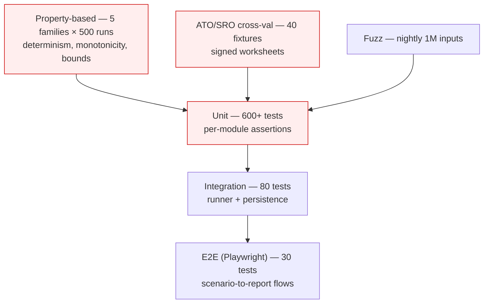

# Engine Test Matrix

> The complete pre-release test plan for `/engine/*`. 50+ explicit unit cases, 5 property-based test families, an ATO/SRO cross-validation suite, and a fuzzing regimen. Every test in this matrix lives in `/engine/__tests__/` and runs on every PR. Coverage threshold: 100 % branch coverage on engine modules — anything less fails CI.

---

## 1. Test Pyramid



The shaded layers are blocking for any release. E2E and fuzz are blocking weekly; nightly failures alert but do not break the build.

---

## 2. Unit Tests by Module

Test IDs follow `<MODULE>-<NN>`. Coverage requirement column shows the branches each test pins.

### 2.1 Amortisation

| ID    | Name                                                               | Module covered     |
| ----- | ------------------------------------------------------------------ | ------------------ |
| AM-01 | P&I monthly payment matches published bank formula                 | `amortiseMonth`    |
| AM-02 | IO-only loan: principal never reduces in IO period                 | `amortiseMonth`    |
| AM-03 | IO → P&I transition at month N: payment recomputes correctly       | `transitionToPI`   |
| AM-04 | Variable rate shock at month N: interest jumps from N onwards      | `effectiveRateBps` |
| AM-05 | Fixed rate revert: post-fixed period uses ruleset revert           | `effectiveRateBps` |
| AM-06 | Offset > principal: effective balance = 0, interest = 0            | `amortiseMonth`    |
| AM-07 | Partial offset: interest charged on (principal − offset)           | `amortiseMonth`    |
| AM-08 | Rounding: monthly interest rounds to whole cents, error < 1 ¢/yr   | `mulCentsBy`       |
| AM-09 | Term ends mid-horizon: subsequent periods have zero balance        | `amortiseMonth`    |
| AM-10 | Negative amortisation guard: principal clamped at 0, warning fires | `amortiseMonth`    |
| AM-11 | Daily-equivalent interest accrual matches actual/365               | `amortiseMonth`    |

### 2.2 CashFlowService

| ID    | Name                                                                | Module covered          |
| ----- | ------------------------------------------------------------------- | ----------------------- |
| CF-01 | Weekly rent normalised to monthly equivalent: 52/12 ratio           | `rentForMonth`          |
| CF-02 | Rent growth compounds annually on FY boundary, not monthly          | `rentForMonth`          |
| CF-03 | Vacancy: 2 weeks/yr reduces rent by 2/52 of annual                  | `rentForMonth`          |
| CF-04 | Mixed-use property: only investment fraction of interest deductible | `apportionDeductible`   |
| CF-05 | Expense stream with end date: stops contributing post-end           | `expensesForMonth`      |
| CF-06 | Property management fee as % of rent recomputes monthly             | `expensesForMonth`      |
| CF-07 | Insurance escalates at CPI when `escalation = 'cpi'`                | `escalateExpense`       |
| CF-08 | Capital expense excluded from operating cash flow                   | `netOperatingCash`      |
| CF-09 | Capital expense added to depreciation pool prospectively            | `buildDepreciationPool` |
| CF-10 | FY rollover June → July correctly buckets income                    | `aggregateToFY`         |
| CF-11 | Leap year: February month has 29 days, daily-rate interest reflects | `daysInMonth`           |
| CF-12 | Half-month at horizon start (mid-month asOf): pro-rates correctly   | `firstPeriodProRation`  |

### 2.3 TaxService

| ID    | Name                                                                  | Module covered          |
| ----- | --------------------------------------------------------------------- | ----------------------- |
| TX-01 | Income exactly at bracket boundary: lower-bracket rate applies        | `applyMarginalRates`    |
| TX-02 | Income $0: tax $0                                                     | `applyMarginalRates`    |
| TX-03 | Income above top bracket: top marginal applied to excess              | `applyMarginalRates`    |
| TX-04 | Negative gearing loss reduces taxable income at marginal rate         | `computeTaxableImpact`  |
| TX-05 | Quarantined neg gearing (ruleset.enabled=false): loss carried forward | `computeTaxableImpact`  |
| TX-06 | Medicare levy applied above threshold, not below                      | `medicareLevy`          |
| TX-07 | Surcharge applied when ruleset surchargeBrackets non-empty            | `medicareLevySurcharge` |
| TX-08 | Depreciation Div 40 increases deduction by FY claim                   | `aggregateDepreciation` |
| TX-09 | Depreciation Div 43 increases deduction AND reduces cost base         | `aggregateDepreciation` |
| TX-10 | Second-hand residential Div 40 disallowed post-2017                   | `eligibilityFilter`     |
| TX-11 | Owner-occupied fraction: deduction × investmentFraction               | `apportionDeductible`   |
| TX-12 | Ownership split 60/40: each owner's marginal rate applied to share    | `splitByOwnership`      |
| TX-13 | Trust ownership: distribution flows to beneficiaries per spec         | `distributeTrustIncome` |
| TX-14 | Company ownership: flat 30 % (or per ruleset), no CGT discount        | `companyTax`            |
| TX-15 | Taxable-income override: ignores computed user income, uses override  | `marginalRateForUser`   |

### 2.4 EquityService

| ID    | Name                                                                 |
| ----- | -------------------------------------------------------------------- |
| EQ-01 | Equity = value − loan, never negative (clamped at 0)                 |
| EQ-02 | Capital growth 0%: value flat over horizon                           |
| EQ-03 | Capital growth 5%: compounds annually on purchase anniversary        |
| EQ-04 | Loan paydown reflected in equity progression                         |
| EQ-05 | Owner share of equity: sums to total equity (no rounding loss > 1 ¢) |

### 2.5 CGTEngine

| ID    | Name                                                                                     |
| ----- | ---------------------------------------------------------------------------------------- |
| CG-01 | Hold < 12 months: no discount                                                            |
| CG-02 | Hold exactly 365 days: no discount (s115-25 requires > 12 months)                        |
| CG-03 | Hold 366 days: 50 % individual discount                                                  |
| CG-04 | SMSF ownership: 33.33 % discount                                                         |
| CG-05 | Company ownership: 0 % discount                                                          |
| CG-06 | Cost base reduced by Div 43 claimed (s110-45)                                            |
| CG-07 | Capital improvements added to cost base                                                  |
| CG-08 | Selling costs (agent + legal) reduce gain                                                |
| CG-09 | Ownership split 50/50: gain halved, marginal rates applied separately                    |
| CG-10 | Joint owners with different marginal rates: total CGT differs from "average rate × gain" |
| CG-11 | Pre-1985 acquisition: CGT exempt                                                         |
| CG-12 | Capital loss: stored as carry-forward, not applied to non-capital income                 |

### 2.6 LandTaxEngine (VIC)

| ID    | Name                                                         |
| ----- | ------------------------------------------------------------ |
| LT-01 | Site value below threshold: $0 land tax                      |
| LT-02 | Site value $1 above threshold: marginal-rate only on $1      |
| LT-03 | Top bracket: flat + marginal applied correctly               |
| LT-04 | Aggregation across multiple VIC properties                   |
| LT-05 | Absentee surcharge: +4 % of site value                       |
| LT-06 | Vacant residential land tax: +2 % of site value              |
| LT-07 | Trust brackets: lower trust thresholds apply                 |
| LT-08 | PPOR exemption: site value excluded from aggregation         |
| LT-09 | Boundary: site value exactly at threshold uses lower bracket |

### 2.7 ScenarioRunner

| ID    | Name                                                       |
| ----- | ---------------------------------------------------------- |
| SR-01 | Identical inputs produce identical outputHash              |
| SR-02 | Cache hit returns cached result without recomputation      |
| SR-03 | Ruleset hash mismatch raises IntegrityError                |
| SR-04 | Engine version mismatch on replay raises VersionError      |
| SR-05 | Deep-frozen inputs reject mutation in dev                  |
| SR-06 | Sale month past horizon: scenario rejected at validation   |
| SR-07 | Warnings collected from all modules and surfaced in result |
| SR-08 | Asof in the past: scenario runs but warning emitted        |
| SR-09 | Horizon 1 year: produces exactly one period, no off-by-one |
| SR-10 | Horizon 40 years: completes under 500 ms wall clock        |

---

## 3. ATO / SRO Cross-Validation

40 fixtures live in `/engine/__tests__/fixtures/cross-val/`. Each fixture is a JSON file containing:

- `inputs`: the scenario inputs
- `ruleset`: a pinned ruleset (FY-locked)
- `expectedOutputs`: ATO worksheet results, manually computed and signed by a CPA
- `source`: ATO publication URL or paper-worksheet identifier
- `signedBy`: CPA initials
- `signedAt`: ISO date

```typescript
// /engine/__tests__/cross-validation.test.ts

import fixtures from './fixtures/cross-val';

describe.each(fixtures)('ATO/SRO fixture: $name', (fixture) => {
  it(`matches expected outputs (source: ${fixture.source})`, async () => {
    const result = await runEngine(fixture.inputs, fixture.ruleset);
    expect(result.summary.totalTaxOverHorizonCents).toBe(
      BigInt(fixture.expectedOutputs.totalTaxCents),
    );
    // ... assert each headline number with bigint equality
  });
});
```

### 3.1 Representative Fixtures

| ID    | Source                                         | Scenario                                             |
| ----- | ---------------------------------------------- | ---------------------------------------------------- |
| XV-01 | ATO TR 97/23 example 1                         | Single PAYG investor, single property, P&I           |
| XV-02 | ATO TR 97/23 example 2                         | IO loan, full deductibility, 2 owners                |
| XV-03 | ATO PS LA 2007/12 worksheet                    | Negative gearing carry-forward year 1                |
| XV-04 | ATO depreciation guide 2023 example A          | Div 40 + Div 43 combined                             |
| XV-05 | ATO depreciation guide 2023 example C          | Second-hand residential, Div 40 disallowed           |
| XV-06 | ATO CGT guide chapter 5                        | Individual, > 12 month hold, 50 % discount           |
| XV-07 | ATO CGT guide chapter 8                        | Joint ownership 50/50, different income brackets     |
| XV-08 | ATO CGT guide chapter 9                        | Capital improvements + selling costs in cost base    |
| XV-09 | SRO VIC land tax bulletin 2025                 | $1.2 M aggregate, individual, no surcharges          |
| XV-10 | SRO VIC land tax bulletin 2025                 | $1.2 M aggregate, absentee surcharge                 |
| XV-11 | SRO VIC VRLT brochure 2025                     | Vacant residential, 6 months unoccupied              |
| XV-12 | SRO VIC trust schedule                         | Trust holds $800 k, special bracket applies          |
| XV-13 | ATO TR 2018/4                                  | Pre-CGT acquisition, exempt sale                     |
| XV-14 | ATO TD 2019/14                                 | Mixed-use 70/30 (investment/PPOR)                    |
| XV-15 | ATO Tax-Time toolkit 2024 worksheet B          | Rent + on-charges, council on-charge included        |
| XV-16 | ATO PS LA 2003/8                               | Refinance: interest deductibility unchanged          |
| XV-17 | Internal CPA worksheet 2024-CFA-019            | SMSF ownership, single-property, 33.33 % discount    |
| XV-18 | Internal CPA worksheet 2024-CFA-024            | Property held by company, no CGT discount            |
| XV-19 | ATO Tax-Time toolkit 2024 worksheet F          | Variable rate shock mid-FY                           |
| XV-20 | ATO Tax-Time toolkit 2024 worksheet G          | IO loan to P&I transition mid-FY                     |
| XV-21 | SRO VIC examples 2024 example 4                | Regional VIC + VRLT expanded scope                   |
| XV-22 | ATO depreciation cap works 1987-09-15 boundary | Construction pre-1987: no Div 43                     |
| XV-23 | ATO depreciation cap works 1987-09-15 boundary | Construction post-1987: Div 43 at 2.5 %              |
| XV-24 | ATO PS LA 2006/12                              | Loan partly for non-investment: interest apportioned |
| XV-25 | ATO TR 2002/18 example 2                       | Pre-paid interest, immediate deduction               |
| XV-26 | ATO TR 95/25                                   | Loan establishment fees: 60-month write-off          |
| XV-27 | ATO CGT determination 4                        | Death of joint tenant: cost base step-up             |
| XV-28 | ATO TD 2010/9                                  | Property used as PPOR then rented: 6-year rule       |
| XV-29 | ATO PS LA 2007/3                               | Re-categorisation of expense (repair vs capital)     |
| XV-30 | ATO TR 97/23 example 5                         | Multiple properties one loan: tracing the interest   |
| XV-31 | Internal CPA worksheet 2024-CFA-031            | Trust distribution to beneficiary with neg gearing   |
| XV-32 | Internal CPA worksheet 2024-CFA-038            | Refinance for equity release: deductibility analysis |
| XV-33 | ATO TR 95/33                                   | Insurance payout: capital vs revenue treatment       |
| XV-34 | SRO VIC absentee owner clarification 2024      | Mixed absentee/resident co-ownership                 |
| XV-35 | ATO TD 2019/4                                  | Bond drawdown: not assessable income                 |
| XV-36 | ATO CGT guide chapter 12                       | Main residence partial exemption (mixed use)         |
| XV-37 | ATO TR 2012/4                                  | Depreciation pooled assets                           |
| XV-38 | ATO depreciation guide 2023 example D          | Low-value pool transition                            |
| XV-39 | SRO VIC commercial property                    | Commercial site value, business activity exemption   |
| XV-40 | Internal CPA worksheet 2024-CFA-042            | 6-year horizon, sale year 6, full lifecycle          |

Each fixture failing → CI red. Fixtures requiring legislative interpretation are reviewed annually with external counsel.

---

## 4. Property-Based Tests

Five families, run 500 iterations each on every CI, 5 000 iterations nightly.

### PBT-01 — Determinism Under Shuffling

For any valid scenario, shuffling the order of `incomeStreams`, `expenseStreams`, and `loans` must not change the output hash.

```typescript
fc.assert(
  fc.property(arbScenarioInputs(), (inputs) => {
    const a = runEngine(inputs);
    const b = runEngine({
      ...inputs,
      incomeStreams: shuffle(inputs.incomeStreams),
      expenseStreams: shuffle(inputs.expenseStreams),
      loans: shuffle(inputs.loans),
    });
    expect(a.outputHash).toBe(b.outputHash);
  }),
);
```

### PBT-02 — Monotonicity of Rent Growth

For any two scenarios identical except `rentGrowthBps`, the one with higher growth must have ≥ gross rent in every period.

### PBT-03 — Monotonicity of Variable Rate

Higher interest rate ⇒ higher cumulative interest paid ⇒ lower (or equal) after-tax cash, all else equal.

### PBT-04 — Bounded Outputs

After-tax cash flow within `[-grossRent × 5, grossRent × 5]` per period (sanity envelope; tighter than `Number.MAX_SAFE_INTEGER` but loose enough to catch sign flips and unit conversion bugs).

### PBT-05 — Idempotent Aggregation

Sum of monthly cash flows = annual cash flow within rounding tolerance ($0.12/year — cap for monthly-to-annual rounding accumulation).

---

## 5. Fuzzing Strategy

Nightly run: 1 million randomly generated scenarios across the input space, with constraints relaxed beyond Zod validation to catch parser-vs-engine drift. Failures are reported with the minimal failing input via `fast-check`'s shrinker.

```typescript
// /engine/__tests__/fuzz.ts (nightly only)

fc.assert(
  fc.property(
    arbScenarioInputsRelaxed(), // some invariants relaxed beyond Zod
    (inputs) => {
      try {
        const result = runEngine(inputs);
        // Engine must not throw for any input that passes Zod
        // Engine must throw a typed error for inputs that fail Zod
      } catch (e) {
        expect(e).toBeInstanceOf(ValidationError); // or EngineError
      }
    },
  ),
  { numRuns: 1_000_000, seed: Date.now() },
);
```

Crashes during fuzz: opens a Sentry issue at severity `error` with the seed and minimal repro attached.

---

## 6. Regression Guardrails

### 6.1 Golden Master Suite

50 hand-picked production-shaped scenarios live in `/engine/__tests__/golden/*.json`. Each contains inputs + expected outputs from the _current_ engine release. On every PR, the engine is run against each and any deviation > $0.01 in any monetary field fails the build.

The golden master regenerates on MAJOR engine bumps, with the diff committed alongside release notes for legal/QA review.

### 6.2 Replay-Last-90-Days

On every MAJOR or MINOR release, CI fetches a representative sample of production scenarios from the last 90 days (anonymised), re-runs them against the new code, and produces a diff report. The release manager must acknowledge the report before publish (see `/operations/deployment-checklist.md` § 6).

---

## 7. Performance Budgets

| Operation                                               | P50    | P95    | P99    |
| ------------------------------------------------------- | ------ | ------ | ------ |
| Run scenario, 5-year horizon, 1 property                | 12 ms  | 30 ms  | 80 ms  |
| Run scenario, 30-year horizon, 1 property               | 60 ms  | 140 ms | 300 ms |
| Run scenario, 10-year horizon, 5 properties (portfolio) | 80 ms  | 200 ms | 500 ms |
| Hash inputs (canonical JSON + sha256)                   | 0.5 ms | 1.5 ms | 4 ms   |
| Ruleset adapter load + freeze                           | 2 ms   | 5 ms   | 10 ms  |

CI fails if benchmark suite (`pnpm bench:engine`) reports P95 > 1.5 × budget for any operation. Benchmarks run on a known-spec ARM runner (`ubuntu-24.04-arm`) for stability.

---

## 8. Coverage Requirements

- Branch coverage: 100 % on `/engine/cashflow/`, `/engine/tax/`, `/engine/cgt/`, `/engine/landtax/`, `/engine/amortisation/`.
- Mutation testing (Stryker) score ≥ 85 % on the same paths, run weekly.
- Type-coverage: 100 % (no `any`, enforced by `type-coverage` CLI).

---

## 9. CI Job Layout

```yaml
# excerpt from .github/workflows/engine-tests.yml
jobs:
  unit:
    runs-on: ubuntu-24.04
    steps:
      - run: pnpm test:engine --coverage --reporter=verbose
      - run: pnpm test:cross-val
      - run: pnpm test:property
      - run: pnpm bench:engine --json | pnpm bench:check
      - run: pnpm test:golden

  fuzz-nightly:
    if: github.event_name == 'schedule'
    runs-on: ubuntu-24.04
    timeout-minutes: 240
    steps:
      - run: pnpm test:fuzz
```

---

## 10. Cross-References

- `/engine/financial-calc-engine.md` — modules under test.
- `/engine/tax-rule-versioning.md` — fixture ruleset preservation.
- `/operations/ci-cd-pipeline.md` § 3 — engine-tests workflow context.
- `/operations/deployment-checklist.md` § 6 — release manager regression review.
