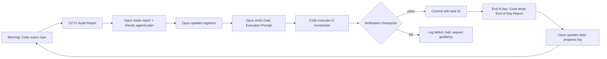

# Execution System

> The operating model for building EquityLens over 15 days. Two roles (Opus = planner/auditor; Code = implementer), one daily ritual ("CCTV Mode"), six living registers, fifteen incremental sprints. Nothing ships without an audit trail. Nothing is built without a written plan. The system exists to keep this a fintech build, not a prototype.

---

## 1. Roles

### 1.1 Claude Opus — Planning & Audit Layer

* Runs in the web/chat interface.
* Reads every CCTV Audit Report at the start of each day.
* Compares observed state against the 15-day plan and the existing `/docs` specifications.
* Updates the six registers (backlog, defects, deviations, daily progress, tech debt, ADR).
* Emits one **Daily Execution Prompt** per day.
* Never edits code, never runs commands. Only produces written artifacts.

### 1.2 Claude Code — Implementation Layer

* Runs in VS Code / terminal.
* Performs the morning repository scan and emits the **CCTV Audit Report**.
* Receives the Daily Execution Prompt verbatim and executes it.
* Pauses at every verification checkpoint defined in the prompt; does not proceed without explicit human confirmation.
* Commits only validated work, with the day number and task ID in the commit message.
* Logs every issue encountered into the appropriate register before continuing.

### 1.3 Boundary Rules

| Action                                  | Opus | Code |
| --------------------------------------- | ---- | ---- |
| Read repository state                   | via CCTV report | yes (direct) |
| Edit code                               | no   | yes  |
| Run shell commands / tests              | no   | yes  |
| Update `/docs/**` specifications        | yes  | only when execution prompt explicitly assigns the doc change |
| Update registers (`/docs/process/registers/*`) | yes (canonical owner) | yes (append-only entries during execution) |
| Decide scope for the day                | yes  | no   |
| Refuse out-of-scope work mid-day        | n/a  | yes (must log deviation and surface) |
| Approve commits                         | no   | requests; human approves |

When the two layers disagree, the resolution is recorded as a deviation, not silently overridden.

---

## 2. Daily Ritual ("CCTV Mode")

### 2.1 Cadence

* Morning audit: 15 minutes.
* Strategic review: 15–30 minutes.
* Execution: bounded by the day's plan; soft cap 6 hours of implementation.
* End-of-day reconciliation: 10 minutes.

If execution runs over, work is **stopped, not extended**. Incomplete items roll into the next day's plan via the backlog.

### 2.2 Verification Checkpoints

Every Daily Execution Prompt defines at least one verification checkpoint per major task. A checkpoint is a concrete, machine-checkable assertion (e.g., "all engine unit tests green and coverage ≥ 95%", "migration applies and reverses cleanly on a fresh DB", "RLS cross-tenant probe denies access"). Code does not pass a checkpoint by self-assessment alone; the named command must be run and its output captured.

---

## 3. Living Registers

All registers live under `/docs/process/registers/` and are committed with every change.

| Register                | File                             | Owner | Purpose                                          |
| ----------------------- | -------------------------------- | ----- | ------------------------------------------------ |
| Product backlog         | `product-backlog.md`             | Opus  | Features not yet built, prioritised              |
| Defect log              | `defect-log.md`                  | Opus  | Bugs and issues, with severity and status        |
| Deviation log           | `deviation-log.md`               | Opus  | Differences from spec, with rationale            |
| Daily progress log      | `daily-progress-log.md`          | Opus  | What was completed each day, with evidence       |
| Technical debt register | `technical-debt.md`              | Opus  | Known shortcuts to be paid down                  |
| ADRs                    | `adr/NNNN-<slug>.md` + index     | Opus  | Architecture decisions with context              |

Code may **append** entries (e.g., a new defect discovered during execution) but only Opus may close, re-prioritise, or restructure entries.

---

## 4. Core Principles

1. **Accuracy over speed.** A wrong number shipped to a user is the worst outcome.
2. **Incremental delivery.** No day's plan introduces more than 3 major features.
3. **Deterministic financial logic.** AI is explanation-only. The engine is pure TypeScript with no external math libraries beyond decimal arithmetic helpers.
4. **Separation of planning and execution.** The planner does not implement. The implementer does not redefine scope.
5. **Traceability.** Every commit references a task ID. Every task ID is in the Daily Execution Prompt. Every prompt is committed to `/docs/process/prompts/<day>.md`.
6. **Audit completeness.** Every defect, deviation, and decision is in writing before the next day starts.
7. **Validation before progress.** A failing checkpoint halts the day's plan; it does not get deferred silently.

---

## 5. Failure Modes & Responses

| Failure                                  | Response                                                                   |
| ---------------------------------------- | -------------------------------------------------------------------------- |
| Checkpoint fails                         | Halt, log defect, request guidance. Do not commit.                         |
| Scope creep mid-day                      | Log as deviation, surface to Opus, continue only with explicit approval.   |
| Spec ambiguity                           | Log as deviation, propose interpretation, surface to Opus, await decision. |
| Engine determinism violation             | Halt all engine work, page Opus for ADR. No commits until resolved.        |
| Test coverage regression                 | Block commit. Restore coverage before continuing.                          |
| Migration not reversible                 | Block commit. Rewrite as expand → migrate → contract.                      |
| AI explanation diverges from engine      | Log defect at severity high. Disable AI surface for affected area.         |
| Time overrun beyond day budget           | Stop. Roll remainder to backlog. Do not work into the next day's slot.     |

---

## 6. Definition of Done (Per Task)

A task within a day's plan is considered done only when **all** of the following hold:

* The code change compiles and type-checks.
* All affected unit, integration, and (where applicable) e2e tests pass.
* For engine work: ATO/SRO fixtures relevant to the change pass.
* For DB work: migration is reversible and RLS coverage is intact.
* For UI work: axe accessibility violations = 0; Lighthouse a11y ≥ 98.
* Coverage thresholds met (engine ≥ 95%, app ≥ 80% on changed files).
* The change references the task ID in the commit message.
* The daily progress log entry is updated with evidence (test output paths, screenshots, hashes).
* No new register entries with severity ≥ high are unresolved by end of day.

---

## 7. Definition of Done (Per Day)

A day is considered done only when:

* All checkpoint commands have been run and their outputs captured.
* The End-of-Day Report has been emitted by Code.
* The daily progress log has been updated by Opus.
* All defects discovered today are recorded with owner and target day.
* Any deviations are recorded with rationale and disposition.
* Any new ADRs are drafted (status may be `proposed` overnight).
* Tomorrow's preliminary scope is sketched in the backlog so the next morning's ritual starts with context.

---

## Cross-References

* `/docs/process/15-day-plan.md` — the day-by-day sprint plan
* `/docs/process/daily-ritual.md` — the procedure in operational detail
* `/docs/process/templates/cctv-audit-report.md` — Code's morning template
* `/docs/process/templates/daily-execution-prompt.md` — Opus's daily output template
* `/docs/process/templates/end-of-day-report.md` — Code's evening template
* `/docs/process/registers/*` — the six living registers
* `/operations/deployment-checklist.md` — release-time gates that build on these checkpoints
