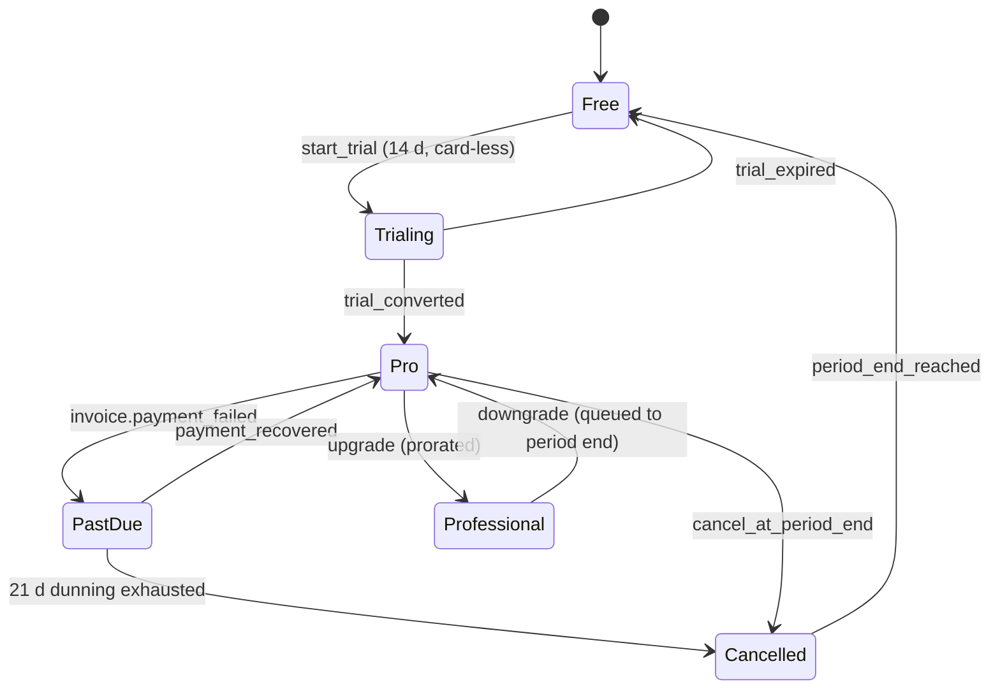

# Pricing & Gating

> Subscription tiers, Stripe wiring, feature gates, and data retention behaviour. Pricing surfaces in AUD inclusive of GST.

---

## 1. Tier Structure

| Capability                          | Free                 | Pro                        | Professional                      |
| ----------------------------------- | -------------------- | -------------------------- | --------------------------------- |
| **Price (AUD inc. GST)**            | $0                   | $29 / month or $290 / year | $89 / month or $890 / year        |
| **Properties**                      | 1                    | 5                          | Unlimited                         |
| **Loans per property**              | 1                    | 3 splits                   | Unlimited splits                  |
| **Scenario runs / month**           | 3                    | 100                        | Unlimited                         |
| **Saved scenarios**                 | 1                    | 25                         | Unlimited                         |
| **Historical scenario retention**   | 30 days              | 24 months                  | 7 years                           |
| **PDF export**                      | Watermarked, 1/month | Unwatermarked, unlimited   | Unwatermarked + custom letterhead |
| **CSV export (ATO-aligned)**        | —                    | ✓                          | ✓                                 |
| **Scheduled reports**               | —                    | Monthly                    | Monthly / quarterly / annual      |
| **AI explanations**                 | 5 / month            | 200 / month                | 1,000 / month                     |
| **Hold vs Sell engine**             | View-only baseline   | Full                       | Full + ETF alternative            |
| **Refinance simulator**             | —                    | ✓                          | ✓                                 |
| **Trust / company ownership**       | —                    | —                          | ✓                                 |
| **Multi-user organisation**         | —                    | —                          | 5 seats included                  |
| **Roles (owner/viewer/accountant)** | —                    | —                          | ✓                                 |
| **API access**                      | —                    | —                          | Read-only (Phase 2)               |
| **Support SLA**                     | Community            | 48 h email                 | 24 h email + onboarding call      |

Pricing is reviewed annually; existing subscribers grandfathered for ≥12 months on legacy pricing.

---

## 2. Stripe Mapping

### 2.1 Product / price catalogue

```ts
// Stripe metadata schema — must match enum in `subscriptions.tier`
type StripeProductMetadata = {
  tier: 'free' | 'pro' | 'professional';
  feature_flags: string; // comma-separated, e.g. "scenario.unlimited,export.csv"
  seat_count: string; // numeric; "0" means N/A
  retention_months: string; // e.g. "84" for 7y
};
```

| Product      | Stripe `product_id` | `price_id` (monthly) | `price_id` (annual) |
| ------------ | ------------------- | -------------------- | ------------------- |
| Pro          | `prod_pro`          | `price_pro_m`        | `price_pro_y`       |
| Professional | `prod_professional` | `price_pro_plus_m`   | `price_pro_plus_y`  |

Stripe is **never** the source of truth for entitlements at runtime. We mirror the active subscription into `subscriptions` table via webhook; UI and API read from Postgres only.

### 2.2 Subscription lifecycle



### 2.3 Webhook events handled

| Stripe event                           | Action                                                                 |
| -------------------------------------- | ---------------------------------------------------------------------- |
| `checkout.session.completed`           | Insert / update `subscriptions`, set `tier`, `current_period_end`.     |
| `customer.subscription.updated`        | Re-sync tier and `cancel_at_period_end`.                               |
| `customer.subscription.deleted`        | Set tier → `free`, retain data per retention rules.                    |
| `invoice.payment_failed`               | Set `status = past_due`, start dunning counter, surface in-app banner. |
| `invoice.payment_succeeded`            | Clear past-due flag.                                                   |
| `customer.subscription.trial_will_end` | 3-day email reminder.                                                  |

All webhooks verified via `stripe-signature`. Idempotency enforced via `stripe_event_id` PK on a `stripe_events` ledger table; replays are no-ops.

### 2.4 Trials

- 14-day card-less Pro trial. Initiated from in-app upgrade CTA.
- Trial state stored as `subscriptions.status = 'trialing'`, `tier = 'pro'`.
- On trial expiry, downgrade to Free; scenarios beyond Free quota become **read-only** for 30 days, then archived.

### 2.5 Dunning

- Day 0: payment fails → email + in-app banner.
- Day 3, 7, 14: automatic Stripe retries.
- Day 14: feature limit hard-enforced; portfolio still viewable.
- Day 21: subscription cancelled; tier → Free.

---

## 3. Upgrade / Downgrade Behaviour

| Transition                         | Effect                                                                                                   | Billing                                  |
| ---------------------------------- | -------------------------------------------------------------------------------------------------------- | ---------------------------------------- |
| Free → Pro                         | Immediate, unlocks instantly.                                                                            | Prorated charge for remainder of period. |
| Pro → Professional                 | Immediate.                                                                                               | Prorated.                                |
| Professional → Pro                 | Queued to period end; UI shows "downgrades on Nov 30".                                                   | No prorated refund.                      |
| Pro → Free                         | Queued to period end.                                                                                    | No refund.                               |
| Multi-property excess on downgrade | Properties beyond new limit become **read-only**; user picks which N stay active via a one-time chooser. | —                                        |
| Scenario excess on downgrade       | Oldest scenarios archived first; user can pin up to the new limit.                                       | —                                        |

Entitlement enforcement is **server-side**. Client-side checks are UX hints only. All enforcement happens in API middleware via `assertEntitlement(user, 'scenario.run')`.

---

## 4. Data Retention Policy

| Data class                          | Free                           | Pro                           | Professional                  | On cancellation                                                   |
| ----------------------------------- | ------------------------------ | ----------------------------- | ----------------------------- | ----------------------------------------------------------------- |
| Properties, loans, income, expenses | Retained while account active  | Retained while account active | Retained while account active | Retained 90 days (read-only) → user must export → hard delete     |
| Scenario results                    | 30 days                        | 24 months                     | 7 years                       | Frozen on downgrade; deleted at retention boundary                |
| Audit logs                          | 12 months                      | 7 years                       | 7 years                       | Retained per regulatory requirement (`audit_logs` is append-only) |
| Generated reports (PDF/CSV)         | 7 days                         | 90 days                       | 12 months                     | Per tier; storage signed URLs expire normally                     |
| Backups                             | 30 days (encrypted, AU region) | 30 days                       | 30 days                       | Per Supabase PITR baseline                                        |

**Account deletion:** triggered by user → 14-day soft-delete window with daily warning emails → hard delete except `audit_logs` (anonymised: user_id replaced with hash) per APP 11 (Security of Personal Information) and legal record-keeping obligations.

---

## 5. Feature Gating Implementation Pattern

Single source of truth lives in `/lib/entitlements.ts`:

```ts
export type Entitlement =
  | 'property.create'
  | 'scenario.run'
  | 'scenario.save'
  | 'export.pdf.unwatermarked'
  | 'export.csv'
  | 'ai.explain'
  | 'org.multiuser'
  | 'trust.ownership'
  | 'refinance.simulator'
  | 'holdsell.etf_alternative';

type Quota = { period: 'month' | 'lifetime'; limit: number } | 'unlimited' | 'unavailable';

export const ENTITLEMENTS: Record<'free' | 'pro' | 'professional', Record<Entitlement, Quota>> = {
  free: {
    'property.create': { period: 'lifetime', limit: 1 },
    'scenario.run': { period: 'month', limit: 3 },
    'scenario.save': { period: 'lifetime', limit: 1 },
    'export.pdf.unwatermarked': 'unavailable',
    'export.csv': 'unavailable',
    'ai.explain': { period: 'month', limit: 5 },
    'org.multiuser': 'unavailable',
    'trust.ownership': 'unavailable',
    'refinance.simulator': 'unavailable',
    'holdsell.etf_alternative': 'unavailable',
  },
  pro: {
    'property.create': { period: 'lifetime', limit: 5 },
    'scenario.run': { period: 'month', limit: 100 },
    'scenario.save': { period: 'lifetime', limit: 25 },
    'export.pdf.unwatermarked': 'unlimited',
    'export.csv': 'unlimited',
    'ai.explain': { period: 'month', limit: 200 },
    'org.multiuser': 'unavailable',
    'trust.ownership': 'unavailable',
    'refinance.simulator': 'unlimited',
    'holdsell.etf_alternative': 'unlimited',
  },
  professional: {
    'property.create': 'unlimited',
    'scenario.run': 'unlimited',
    'scenario.save': 'unlimited',
    'export.pdf.unwatermarked': 'unlimited',
    'export.csv': 'unlimited',
    'ai.explain': { period: 'month', limit: 1000 },
    'org.multiuser': { period: 'lifetime', limit: 5 },
    'trust.ownership': 'unlimited',
    'refinance.simulator': 'unlimited',
    'holdsell.etf_alternative': 'unlimited',
  },
};
```

API middleware example:

```ts
export async function assertEntitlement(
  userId: string,
  key: Entitlement,
  ctx: { now: Date },
): Promise<void> {
  const sub = await getActiveSubscription(userId);
  const quota = ENTITLEMENTS[sub.tier][key];
  if (quota === 'unavailable') throw new EntitlementError('TIER_LOCKED', key);
  if (quota === 'unlimited') return;
  const used = await countUsage(userId, key, quota.period, ctx.now);
  if (used >= quota.limit) throw new EntitlementError('QUOTA_EXCEEDED', key);
}
```

Usage counts are tracked via the `usage_events` table (indexed on `(user_id, entitlement, period_key)`); see `/database/schema.sql`.

---

## 6. Disclaimers (Pricing Pages)

Every pricing page surface must display:

> _EquityLens provides decision-support tools only. Outputs are not financial, tax, or legal advice. Estimates rely on user-supplied inputs and versioned Australian tax rules. Always consult a registered tax agent or financial adviser before acting on results._

See `/architecture/security-and-compliance.md` for placement and legal sign-off requirements.
