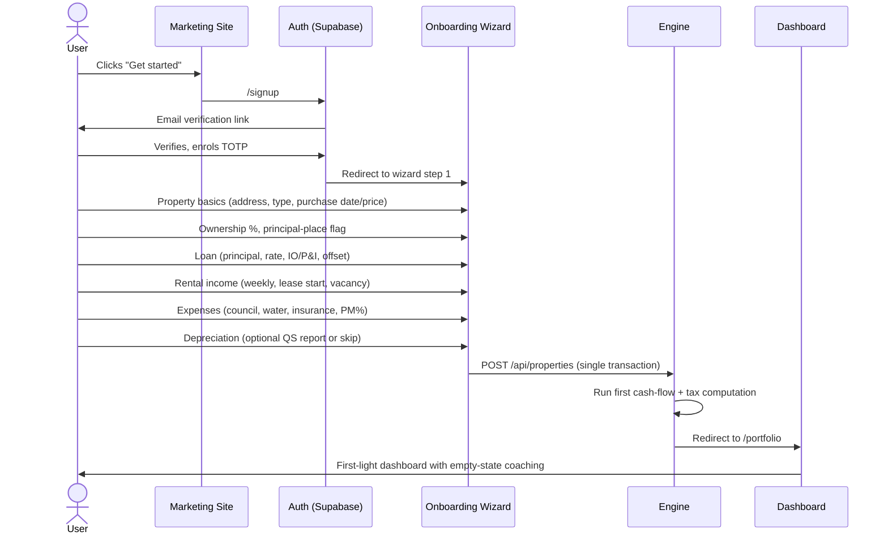
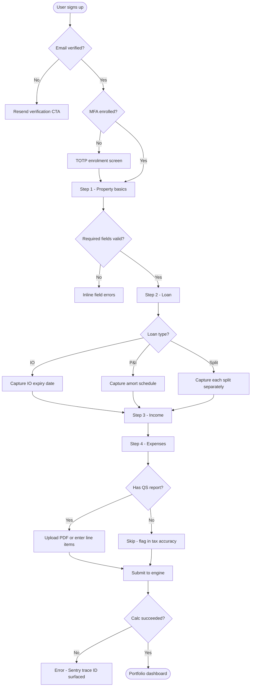
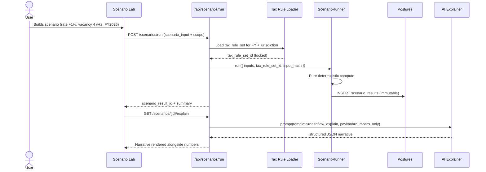
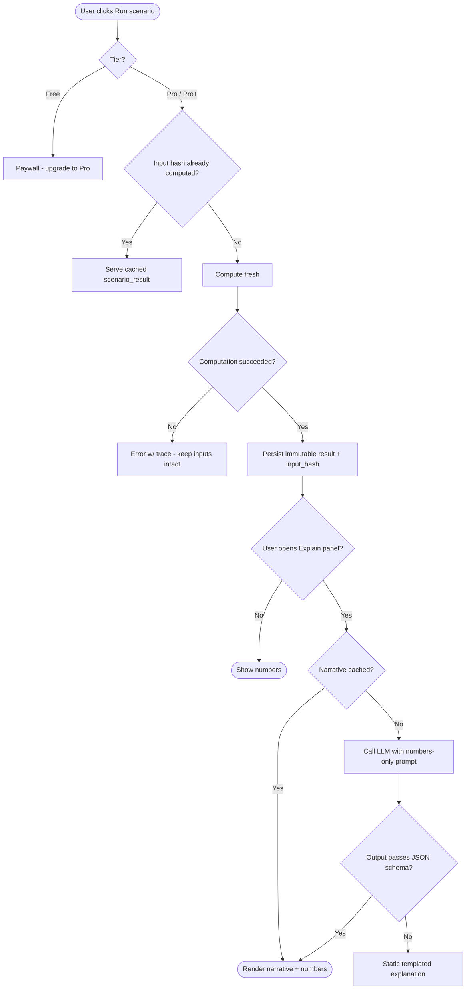
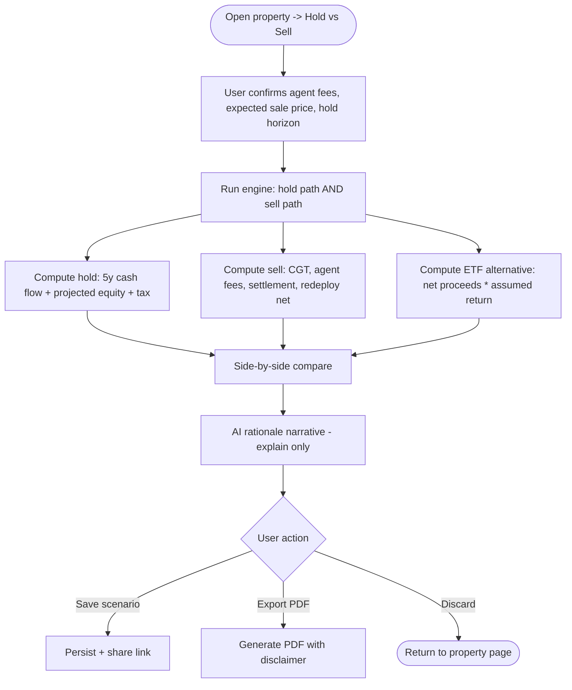
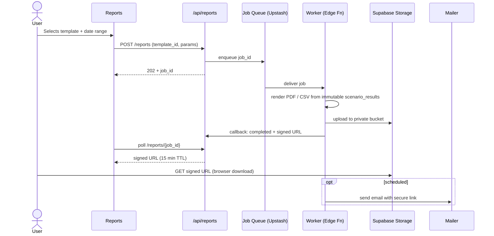

# User Flows

> Step-by-step flows, decision trees, error states, and empty-state handling for the core product surfaces. Mermaid diagrams are the source of truth — UI implementations must match these.

---

## 1. Onboarding

### 1.1 Happy path



### 1.2 Onboarding decision tree



### 1.3 Empty / error states

| State                             | Trigger                               | UX response                                                                                                |
| --------------------------------- | ------------------------------------- | ---------------------------------------------------------------------------------------------------------- |
| No properties                     | Account created, wizard not completed | Full-page "Add your first property" CTA with 6-minute estimate badge.                                      |
| Wizard abandoned mid-flow         | User leaves before submit             | Draft persisted in `properties.status='draft'`; banner on next visit "Resume onboarding".                  |
| Engine calc failure               | Deterministic engine throws           | Display Sentry-issued trace ID, block dashboard, offer "Contact support" with prefilled context.           |
| Missing depreciation              | User skipped QS                       | Tax accuracy banner: amber. Tooltip: "Depreciation missing — your tax estimate may understate deductions." |
| Invalid loan rate (>20% or <0.1%) | Validation                            | Inline error with link to "Why this matters".                                                              |

---

## 2. Property Import

```mermaid
sequenceDiagram
    actor U as User (Pro)
    participant UI as Portfolio UI
    participant API as /api/properties/import
    participant V as Zod Validator
    participant E as Engine
    participant DB as Postgres

    U->>UI: Selects CSV (template downloaded)
    UI->>API: multipart/form-data, idempotency-key
    API->>V: Parse rows -> ImportRowSchema[]
    V-->>API: row-level errors (if any)
    alt all rows valid
        API->>DB: BEGIN
        API->>DB: insert properties, loans, income, expenses
        API->>E: enqueue first calc per property
        API->>DB: COMMIT
        API-->>UI: { imported: N, calc_pending: N }
    else partial validation failure
        API-->>UI: 422 with per-row error map; nothing written
    end
    E->>DB: write scenario_results (baseline)
    UI->>U: Toast "Calcs ready" after polling
```

**Rules**

- Imports are atomic: 1 invalid row → entire file rejected with row-by-row diagnostics. We do **not** partially import.
- Idempotency key required; reusing the key returns the previous result, never duplicates.
- File limits: ≤2 MB, ≤500 rows per request. Larger imports queue via Edge Function.

---

## 3. Scenario Simulation

### 3.1 Flow



### 3.2 Decision tree



### 3.3 Empty / error states

| State                             | UX                                                                |
| --------------------------------- | ----------------------------------------------------------------- |
| No baseline yet                   | Scenario Lab disabled with CTA "Complete a property first".       |
| Engine fails on edge input        | Show inputs, do not store partial result, expose trace ID.        |
| AI down or timeout (>4s)          | Render templated fallback narrative. No retries surfaced to user. |
| Tax rule for requested FY missing | Block run; show "Coming soon for FY2027" message.                 |

---

## 4. Hold vs Sell Decision



**Edge cases**

- Property held <12 months → CGT 50% discount not applied; UI highlights this.
- Joint ownership → tax computed per owner share, presented per-owner and aggregated.
- Trust ownership → distribution scenario configurable; default = equal distribution.

---

## 5. Report Export



### 5.1 Empty states

- No properties → Reports page shows lock state with onboarding CTA.
- No scenarios yet → Only "Portfolio Summary" and "Per-Property Snapshot" templates available; scenario-based templates greyed out.

### 5.2 Failure handling

- PDF render failure → retry x2 with exponential backoff; on final failure, alert user via in-app notification + email; never silent.
- Email delivery bounce → mark notification as failed; user can re-trigger from in-app job history.

---

## 6. Cross-references

- API contracts for each call → `/architecture/api-contracts.md`
- Engine determinism guarantees → `/engine/financial-calc-engine.md`
- AI prompt templates → `/architecture/ai-integration.md`
