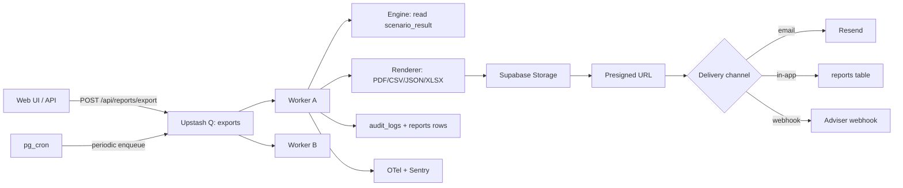
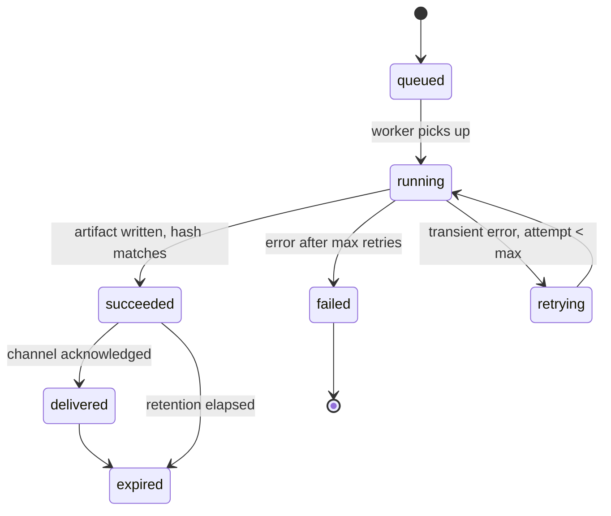

# Scheduling & Delivery

> How EquityLens schedules, executes, stores, and delivers reports. Exports are produced by background workers — never inline in the request — to keep API latency predictable and to allow retries, idempotency, and observability. Delivery is via presigned URLs, transactional email, or in-app inbox, all audit-logged and APP-aligned.

---

## 1. Architectural Overview



* **No synchronous rendering**: `/api/reports/export` enqueues and returns a `report_id` plus a polling URL.
* **Idempotent**: jobs carry a deterministic key `sha256(scenario_result_id|template_slug|template_version|purpose|tenant_id)`; duplicate submissions return the existing row.
* **Two queues**: `exports.fast` (interactive PDFs/CSVs, p95 budget 8s) and `exports.bulk` (adviser packs, full data exports, scheduled jobs, p95 budget 60s).

---

## 2. Job Lifecycle



`reports.state` mirrors this state machine. Transitions are written via a SECURITY DEFINER function so workers cannot skip states.

| State       | Meaning                                                 |
| ----------- | ------------------------------------------------------- |
| `queued`    | In Upstash queue, not yet picked                        |
| `running`   | Worker active; `started_at` set                         |
| `retrying`  | Last attempt failed transiently; backoff before retry   |
| `succeeded` | Artifact stored, `output_hash` set, presigned URL ready |
| `delivered` | Delivery channel acknowledged (email sent, etc.)        |
| `failed`    | Exceeded max retries; surfaced to user                  |
| `expired`   | Retention elapsed; storage object deleted               |

---

## 3. Schema

```sql
CREATE TABLE equitylens.reports (
  id                  uuid PRIMARY KEY DEFAULT gen_random_uuid(),
  tenant_id           uuid NOT NULL REFERENCES equitylens.tenants(id),
  requested_by        uuid NOT NULL REFERENCES equitylens.users(id),
  scenario_result_id  uuid NOT NULL REFERENCES equitylens.scenario_results(id),
  template_slug       text NOT NULL,
  template_version    text NOT NULL,
  format              text NOT NULL CHECK (format IN ('pdf','csv','json','xlsx')),
  purpose             text NOT NULL CHECK (purpose IN ('personal','adviser','data_export','scheduled')),
  locale              text NOT NULL DEFAULT 'en-AU',
  state               text NOT NULL DEFAULT 'queued',
  idempotency_key     text NOT NULL,
  queue_name          text NOT NULL,
  attempt             int  NOT NULL DEFAULT 0,
  max_attempts        int  NOT NULL DEFAULT 5,
  output_hash         text,
  storage_key         text,
  byte_length         bigint,
  ruleset_version     text,
  engine_version      text,
  error_class         text,
  error_message       text,
  delivery_channels   jsonb NOT NULL DEFAULT '[]'::jsonb,
  delivered_at        timestamptz,
  started_at          timestamptz,
  finished_at         timestamptz,
  expires_at          timestamptz,
  created_at          timestamptz NOT NULL DEFAULT now(),
  CONSTRAINT reports_idempotency UNIQUE (tenant_id, idempotency_key)
);

CREATE INDEX reports_state_idx     ON equitylens.reports (state) WHERE state IN ('queued','running','retrying');
CREATE INDEX reports_tenant_recent ON equitylens.reports (tenant_id, created_at DESC);
CREATE INDEX reports_expires_idx   ON equitylens.reports (expires_at) WHERE state IN ('succeeded','delivered');

CREATE TABLE equitylens.report_schedules (
  id                  uuid PRIMARY KEY DEFAULT gen_random_uuid(),
  tenant_id           uuid NOT NULL REFERENCES equitylens.tenants(id),
  scenario_id         uuid NOT NULL REFERENCES equitylens.scenarios(id),
  template_slug       text NOT NULL,
  template_version    text NOT NULL,
  cron               text NOT NULL,           -- e.g. '0 9 1 * *' (1st of month 09:00 AEST)
  timezone           text NOT NULL DEFAULT 'Australia/Melbourne',
  recipients         jsonb NOT NULL,          -- [{ kind, target }]
  is_paused          boolean NOT NULL DEFAULT false,
  last_run_at        timestamptz,
  next_run_at        timestamptz,
  created_by         uuid NOT NULL REFERENCES equitylens.users(id),
  created_at         timestamptz NOT NULL DEFAULT now()
);

CREATE INDEX report_schedules_next_run_idx ON equitylens.report_schedules (next_run_at)
  WHERE is_paused = false;
```

RLS policies (see `/database/rls-policies.sql`) restrict reads/writes to the requesting tenant. Workers connect as a service role inside Edge Functions and explicitly set `tenant_id` filters; no cross-tenant writes are possible.

---

## 4. Worker Implementation

Workers run as Supabase Edge Functions on a 5-second poll, plus a webhook trigger from Upstash QStash for low-latency pickup.

```ts
// supabase/functions/exports-worker/index.ts (excerpt)
import { createClient } from '@supabase/supabase-js';
import { render } from '@equitylens/reports';
import { withSpan, recordError } from '@/observability';

const MAX_CONCURRENT = 4;
const VISIBILITY_TIMEOUT_MS = 90_000;

export default async function handler(_req: Request): Promise<Response> {
  return withSpan('exports.worker.poll', async (span) => {
    const claims = await claimJobs({ limit: MAX_CONCURRENT, visibility: VISIBILITY_TIMEOUT_MS });
    span.setAttribute('equitylens.jobs_claimed', claims.length);

    await Promise.allSettled(claims.map(processJob));
    return new Response('ok');
  });
}

async function processJob(job: ReportJob): Promise<void> {
  return withSpan('exports.worker.process', async (span) => {
    span.setAttributes({
      'equitylens.report_id': job.id,
      'equitylens.tenant_id_hash': hashTenant(job.tenant_id),
      'equitylens.template': `${job.template_slug}@${job.template_version}`,
    });

    try {
      await transition(job.id, 'running');

      const result = await render({
        scenarioResultId: job.scenario_result_id,
        templateSlug:     job.template_slug,
        templateVersion:  job.template_version,
        locale:           job.locale,
        requestedBy:      job.requested_by,
        tenantId:         job.tenant_id,
        purpose:          job.purpose,
      });

      await transition(job.id, 'succeeded', {
        output_hash:    result.outputHash,
        storage_key:    result.storageKey,
        byte_length:    result.byteLength,
        ruleset_version: result.rulesetVersion,
        engine_version:  result.engineVersion,
        expires_at:     computeRetention(job.purpose),
      });

      await deliver(job, result);
      await transition(job.id, 'delivered');
    } catch (err) {
      const classification = classifyError(err);
      recordError(err, span);

      if (classification === 'transient' && job.attempt < job.max_attempts) {
        await scheduleRetry(job, backoff(job.attempt));
      } else {
        await transition(job.id, 'failed', {
          error_class:   err.name,
          error_message: redact(err.message),
        });
        await notifyUserOfFailure(job);
      }
    }
  });
}

function backoff(attempt: number): number {
  // Exponential with jitter, max 5 min
  const base  = Math.min(300_000, 1_000 * 2 ** attempt);
  const jitter = Math.floor(Math.random() * 1_000);
  return base + jitter;
}
```

### 4.1 Concurrency & Isolation

* Each worker instance processes ≤ 4 jobs concurrently to bound memory (PDF rendering is the hot path).
* Job claim uses `SELECT … FOR UPDATE SKIP LOCKED` against `reports` filtered by `state = 'queued'` to prevent double-pickup.
* Visibility timeout is 90s; if a worker dies, the job becomes claimable again.

### 4.2 Error Classification

| Class       | Examples                                                      | Retry? |
| ----------- | ------------------------------------------------------------- | ------ |
| `transient` | Network timeout, Storage 503, Stripe API blip, AI 429         | Yes    |
| `permanent` | Template missing, scenario not found, RLS denial, schema validation | No |
| `poison`    | Job repeatedly fails the same way for > 3 attempts            | Move to DLQ |

A dead-letter queue (`exports.dlq`) holds poison jobs for inspection; an alert fires on any DLQ insertion.

---

## 5. Idempotency

The idempotency key combines all inputs that determine the output:

```ts
const key = sha256([
  scenarioResultId,
  templateSlug,
  templateVersion,
  purpose,
  tenantId,
  locale,
].join('|'));
```

`POST /api/reports/export` performs an upsert against `(tenant_id, idempotency_key)`. If a row already exists in a terminal state, the API returns the existing record without re-enqueuing. If it exists in a non-terminal state, the API returns the existing record and reuses the in-flight job.

The hash specifically **excludes** wall-clock time so duplicate clicks within milliseconds collapse correctly. It includes `template_version` so a user re-running under a newer template gets a new artifact.

---

## 6. Delivery Channels

Each report can have multiple delivery channels. Channels are attempted in order; failures on later channels do not invalidate earlier successes.

### 6.1 Presigned URL (default)

* Generated against Supabase Storage with 7-day expiry (24 hours for `data_export`).
* Returned via `/api/reports/:id` once `state ∈ {succeeded, delivered}`.
* URL minting is rate-limited per user (60/day) and audit-logged.

### 6.2 Email (Resend)

* Triggered when channel `{ kind: 'email', target: '<address>' }` is requested.
* The email contains:
  * The report header (template name, scenario name, generated date)
  * The presigned URL (single-use redirect via `/r/:token` which logs the click and forwards to Storage)
  * The full disclaimer block (HTML + plain text)
  * Footer: tenant name, "you received this because…" line, unsubscribe / preferences link
* Email PII boundary: address is the only recipient field; the email does not embed the recipient's TFN, DOB, or any high-sensitivity data. The report itself is **not** attached — only linked — to limit blast radius.
* Bounces and complaints flow into a webhook that pauses future schedules for that address until the user re-confirms.

### 6.3 In-App Inbox

* All reports automatically appear under `/reports` in the web UI.
* The inbox is the canonical surface; email and webhooks are secondary.

### 6.4 Adviser Webhook (Professional tier)

* Requested via `{ kind: 'webhook', target: '<url>', secret_ref: '<vault-ref>' }`.
* POST body is a JSON envelope:

```json
{
  "type": "report.ready",
  "report_id": "01HZK…",
  "tenant_id": "01HZ…",
  "scenario_id": "01HZ…",
  "template": "adviser-pack@1.0.0",
  "format": "pdf",
  "output_hash": "sha256:…",
  "presigned_url": "https://…",
  "expires_at": "2026-05-26T03:14:22.881Z",
  "ruleset_version": "FY2026-VIC-3",
  "engine_version": "2.4.1",
  "generated_at": "2026-05-19T03:14:22.881Z"
}
```

* Signed with `X-EquityLens-Signature: sha256=<hex>` using the adviser's webhook secret (HMAC-SHA256 over the raw body); replayed timestamps `> 5min` skew are rejected.
* Retries: 5 attempts with exponential backoff over 6 hours. A consistently failing endpoint is paused after 24 hours of failures and the user notified in-app.

---

## 7. Scheduled Exports

Users on Pro and Professional tiers can schedule recurring exports.

### 7.1 Cron Driver

`pg_cron` runs a single tick every minute that enqueues any due schedule:

```sql
SELECT cron.schedule(
  job_name := 'pwi-report-schedules-tick',
  schedule := '* * * * *',
  command  := $$SELECT equitylens.enqueue_due_report_schedules(now())$$
);
```

The function computes `next_run_at` using the schedule's `cron` and `timezone`, then inserts a `reports` row in `queued` state and bumps `next_run_at` to the following occurrence.

### 7.2 Constraints

* Maximum 50 schedules per tenant.
* Minimum cadence: daily. Sub-daily cadence is rejected (no business case, abuse risk).
* Per-tenant rate limit: at most 20 scheduled exports active in any 60-minute window; bursts spread across `exports.bulk` queue.
* Pausing a schedule retains it; deletion is via explicit user action.

### 7.3 Schedule Mutation Audit

Every create/update/pause/delete writes an `audit_logs` row including the cron expression diff. Schedules that depend on a `scenario_id` are paused automatically if the underlying scenario is deleted.

---

## 8. Storage & Retention

Storage paths and retention align with `/reports-exports/export-templates.md` §10. The retention worker runs hourly:

```sql
-- Mark expired
UPDATE equitylens.reports
SET state = 'expired', storage_key = NULL
WHERE state IN ('succeeded','delivered')
  AND expires_at < now()
RETURNING id, storage_key;

-- Delete underlying objects in batches via Storage API (worker code, idempotent)
```

For `audit-pinned` reports (those referenced by an investigation hold or legal request), retention is overridden by an `audit_holds` table; the retention worker skips any report with an active hold.

---

## 9. APP 12 Data Export Path

Right-to-access requests are first-class:

1. User submits a request via `/account/data-export` or by emailing `privacy@equitylens.com.au`.
2. A privileged operator approves the request (UI gated by `role = 'privacy_officer'`); approval writes a `data.export_requested` audit row.
3. The export job is enqueued with `template_slug='data-export-full'`, `purpose='data_export'`, `max_attempts=3`.
4. On success, a presigned URL is delivered via email and shown in-app. URL expires in 24 hours.
5. Download is logged (`data.export_downloaded`). After expiry the artifact is deleted.
6. The audit trail demonstrates compliance even after the artifact is gone.

SLAs:
* Acknowledge within 7 days.
* Deliver within 30 days (statutory ceiling for APP 12).
* Operational target: deliver within 5 business days.

---

## 10. Right-to-Erasure Interaction

Erasure (APP-aligned right to deletion) interacts with reports:

* Pending exports for a user being deleted are cancelled.
* Existing successful reports for the user's tenants are scheduled for purge (`state='expired'` + storage object delete).
* `audit_logs` rows referencing the user are **retained** (pseudonymised) since they record actions, not personal characteristics, and are subject to a legitimate-purpose exception under APP 11.2.
* The erasure runbook in `/architecture/security-and-compliance.md` is the source of truth; this document only describes the report-side behaviour.

---

## 11. Observability

Every job emits:

* Spans: `exports.worker.poll`, `exports.worker.process`, `report.render.<format>`, `report.deliver.<channel>`
* Metrics:
  * `report_jobs_total{state, format, purpose}`
  * `report_job_duration_seconds{format}` (histogram)
  * `report_queue_depth{queue}` (gauge, scraped from Upstash)
  * `report_delivery_attempts_total{channel, outcome}`
  * `report_dlq_total{template}` (counter, alerts on > 0)
* Logs: structured per-job, with `report_id`, `tenant_id_hash`, `scenario_id`, `template`, `attempt`, outcome.

SLOs:
* `exports.fast` p95 wall-clock from enqueue to `succeeded`: ≤ 8 s
* `exports.bulk` p95: ≤ 60 s
* Delivery success rate: ≥ 99.5% within 5 minutes of `succeeded`
* DLQ insertion rate: 0 in steady state; any non-zero pages on-call

---

## 12. Rate Limits & Abuse Controls

| Surface                                | Limit                                      |
| -------------------------------------- | ------------------------------------------ |
| `/api/reports/export` per user         | 60 / hour (Pro), 200 / hour (Professional) |
| `/api/reports/:id/url` (URL minting)   | 60 / day / user                            |
| Schedule creation                      | 5 / hour / tenant                          |
| Email recipient diversity              | ≤ 10 distinct addresses / tenant / 24h     |
| Webhook target additions               | ≤ 5 / day / tenant                         |
| Total active schedules                 | 50 / tenant                                |

Limits are enforced at the API gateway via Upstash Redis token buckets. Breaches return `429` with a `Retry-After` header and an `X-EquityLens-RateLimit-Reset` epoch.

---

## 13. Failure Modes & User Surfacing

* **Transient failures** are invisible to the user; the inbox card shows a spinner until success or final failure.
* **Final failures** (state = `failed`) show an inbox banner with the error class (human-readable: "Tax ruleset retired", "Scenario unavailable", "Internal error") and a retry button. Retry produces a new `report_id`.
* **Stuck jobs** (running > visibility timeout × 2) are surfaced on the ops dashboard and auto-reset by a janitor job that runs every 15 minutes.
* **Bulk failures** (e.g. provider outage spikes failure rate above 5%) trigger an automatic statuspage component update and a temporary back-off on schedules.

---

## 14. Security Considerations

* Workers run with a scoped service-role JWT that grants access only to `reports`, `scenario_results`, `tax_rule_sets`, `disclaimers`, and Storage paths under `tenants/{tenant_id}/reports/`.
* The renderer is a separate package without DB credentials; it receives the materialised inputs from the worker and returns a buffer.
* Storage objects are private; presigned URLs are the only way to read.
* Email delivery uses DKIM + SPF + DMARC for `equitylens.com.au`; bounce handling avoids amplification.
* Webhook signatures are HMAC-SHA256; secrets stored in Vault, referenced by `secret_ref`.
* Logs do not include the rendered artifact contents — only hashes and metadata.

---

## Cross-References

* `/reports-exports/export-templates.md` — template definitions consumed by these workers
* `/product/pricing-and-gating.md` — tier-based entitlements for scheduling and channels
* `/architecture/api-contracts.md` — `/api/reports/*` endpoints
* `/architecture/security-and-compliance.md` — APP 12 export and APP 11 erasure runbooks
* `/architecture/system-architecture.md` — placement of Edge Functions and Upstash queue
* `/database/schema.sql` — `reports`, `report_schedules`, `audit_logs`
* `/database/rls-policies.sql` — tenant isolation for reports
* `/engine/financial-calc-engine.md` — `scenario_results` shape consumed by renderer
* `/operations/ci-cd-pipeline.md` — deploys to workers and Edge Functions
* `/operations/monitoring-and-observability.md` — metrics, SLOs, alerts cited here
* `/operations/deployment-checklist.md` — pre-deploy gates including export smoke tests
