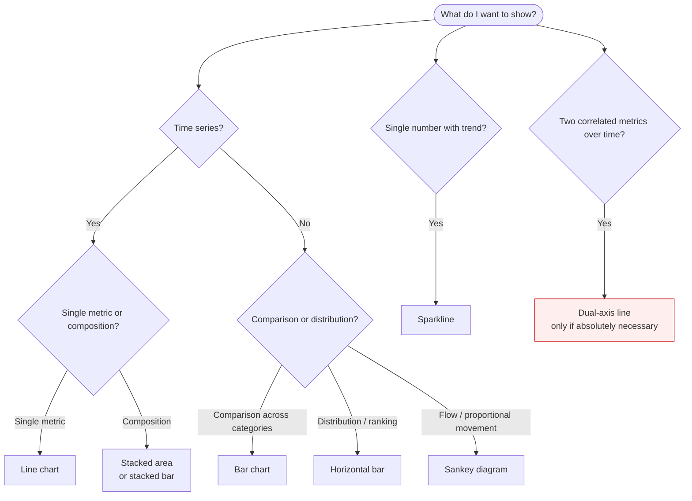
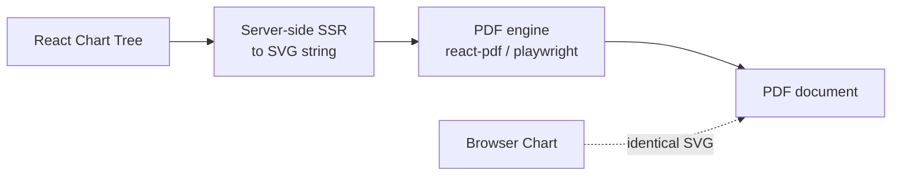

# Data Visualisation Guidelines

> Recharts-based chart standards for EquityLens. Chart-type selection rules, theming, performance, accessibility, and PDF export parity. Every chart in the product passes through `<Chart />`, our wrapper around Recharts that enforces the design system, disables animation, and renders a parallel accessible data table.

---

## 1. Principles

1. **Numbers first, picture second.** Every chart has a companion table (visible on demand or to screen readers). The chart is interpretation; the table is record.
2. **Truth in scale.** Y-axes start at zero for absolute values (rent, cash flow). Truncated axes are permitted only for indexed comparisons and require an inline "Indexed to 100" label.
3. **No decorative animation.** Charts mount instantly. Tooltips appear on hover, not entry. Numbers don't count up.
4. **Same data → same colour, always.** Series-to-colour mapping is stable within a session via a `useChartPalette` hook keyed on series ID.
5. **Print-ready.** Every chart renders identically in PDF export via the same React tree, server-side rendered to SVG. No client-only effects.
6. **Disclosure on signal.** When a chart shows projected (future) values, the projected portion is rendered with a hatched fill and a dashed line, making forecast vs actual unambiguous.

---

## 2. Chart Selection Decision Tree



### 2.1 Approved Chart Types

| Type         | Use case                                                            | Notes                                          |
| ------------ | ------------------------------------------------------------------- | ---------------------------------------------- |
| Line         | Equity over time, loan balance, value over horizon                  | Always 2px stroke                              |
| Stacked area | Cash-flow composition over time (income segments, expense segments) | Use for parts-of-whole                         |
| Stacked bar  | FY-level breakdowns (period buckets ≤ 24)                           | Preferred over area for discrete periods       |
| Bar          | Comparisons (property A vs B)                                       | Horizontal when category labels are long       |
| Sparkline    | KPI tile trend (12-month)                                           | No axes, no labels                             |
| Sankey       | Cash flow from income → categories → net                            | Reserved for the "Where does my rent go?" view |
| Heatmap      | Sensitivity tables (rate × growth grid)                             | Used only in Scenario Lab advanced view        |

### 2.2 Forbidden Chart Types

- **Pie / donut charts.** Banned. Cannot accurately compare slices; stacked bars communicate part-of-whole better.
- **Radar / spider charts.** No legitimate use case in our domain.
- **3D charts.** Banned, always.
- **Dual-axis charts.** Strongly discouraged. Allowed only with explicit "axis A: X, axis B: Y" labels above each axis, never on dashboards. The two cases where dual-axis is permitted: (1) Property value vs Loan balance (both monetary, same axis preferred anyway); (2) advanced sensitivity overlays. Never for "rate vs cash flow" — the unit mismatch invites misreading.
- **Gauges.** No KPI is bounded enough to gauge.

---

## 3. The `<Chart />` Wrapper

```tsx
// /components/charts/chart.tsx

interface ChartProps<TDatum> {
  data: readonly TDatum[];
  type:
    | 'line'
    | 'area'
    | 'bar'
    | 'stacked-area'
    | 'stacked-bar'
    | 'sparkline'
    | 'sankey'
    | 'heatmap';
  series: ChartSeries<TDatum>[];
  xAxis?: AxisConfig;
  yAxis?: AxisConfig;
  yAxisRight?: AxisConfig; // ONLY for the two permitted dual-axis cases
  marker?: ProjectionMarker; // { fromIndex: number } — beyond this, render hatched
  height?: number; // default: 300
  title?: string;
  description?: string; // a11y description
  exportFilename?: string;
  className?: string;
  // The companion table is auto-generated from `data + series`.
  hideCompanionTable?: boolean; // default false
}

export function Chart<T>(props: ChartProps<T>) {
  const palette = useChartPalette();
  const reducedMotion = usePrefersReducedMotion();
  return (
    <figure className={cn('chart-figure', props.className)} aria-label={props.title}>
      <ChartHeader title={props.title} exportName={props.exportFilename} />
      <RechartsTree
        {...props}
        palette={palette}
        isAnimationActive={false}
        margin={DEFAULT_MARGIN}
      />
      <CompanionTable data={props.data} series={props.series} hidden={!props.hideCompanionTable} />
    </figure>
  );
}
```

All charts in the product flow through this wrapper. Direct Recharts imports outside `/components/charts/*` are blocked by ESLint.

---

## 4. Theming

The wrapper translates design-system tokens to Recharts props. We never inline colours.

```tsx
// /components/charts/theme.ts

export const chartTheme = {
  axis: {
    stroke: 'var(--border-strong)',
    tickColor: 'var(--fg-subtle)',
    fontSize: 12,
    fontFamily: 'var(--font-numeric)',
    tickFormatter: (v: number) => formatCompactAUD(v),
  },
  grid: {
    stroke: 'var(--border-default)',
    strokeDasharray: '3 3',
    horizontal: true,
    vertical: false, // vertical grid lines almost always noise
  },
  tooltip: {
    backgroundColor: 'var(--bg-elevated)',
    border: '1px solid var(--border-strong)',
    borderRadius: 'var(--radius-md)',
    boxShadow: 'var(--shadow-2)',
    fontFamily: 'var(--font-numeric)',
    fontSize: 13,
    padding: '10px 12px',
  },
  legend: {
    iconType: 'square' as const,
    iconSize: 10,
    fontSize: 12,
    fontFamily: 'var(--font-sans)',
    color: 'var(--fg-muted)',
  },
  series: {
    line: { strokeWidth: 2, dot: false, activeDot: { r: 4 } },
    area: { fillOpacity: 0.15, strokeWidth: 1.5 },
    bar: { radius: [3, 3, 0, 0] as [number, number, number, number] },
  },
};
```

### 4.1 Palette Allocation

The 8-colour chart palette (defined in `/ui-ux/design-system.md` § 2.4) is consumed in series-declaration order. The wrapper exposes a hook that records assignments per series ID for the session:

```tsx
// Always assign the same colour to the same logical series across views.
const palette = useChartPalette();
const colorRent = palette.assign('rent');
const colorExpenses = palette.assign('expenses');
const colorInterest = palette.assign('interest');
```

Across the property detail tabs, "rent" is always the same chart colour.

### 4.2 Forecast vs Actual

Projected periods (anything beyond `asOf`) render with `strokeDasharray="4 4"` and a hatched fill pattern. A vertical reference line marks the boundary with a small "Projected →" label.

```tsx
<ReferenceLine
  x={asOfMonth}
  stroke="var(--border-strong)"
  strokeDasharray="2 2"
  label={{ value: 'Projected →', position: 'top', fill: 'var(--fg-subtle)', fontSize: 11 }}
/>
```

### 4.3 Tooltip Format

- Title: period label (e.g. "FY2026" or "Mar 2026")
- Series rows: colour swatch · label · right-aligned tabular-numeric value
- Footer: contextual hint when relevant (e.g. "Includes Div 43 depreciation")

The tooltip never modifies state and never makes a network call.

### 4.4 Legend

- Top-left aligned for monetary charts.
- Single-line, wraps cleanly.
- Clicking a legend entry toggles visibility — the toggle state is announced via `aria-live`.

---

## 5. Performance

### 5.1 Data Volumes

| Chart class               | Max points | Strategy if exceeded                      |
| ------------------------- | ---------- | ----------------------------------------- |
| Sparkline                 | 60         | Pre-aggregate                             |
| KPI trend chart           | 120        | Monthly aggregation                       |
| Scenario cash flow (line) | 480        | Monthly granularity, no decimation needed |
| Sensitivity heatmap       | 20 × 20    | Server-side pre-compute                   |

If a chart needs more than the maximum, the wrapper raises an error in dev mode and decimates in prod with a footer note "decimated for display."

### 5.2 Render Strategy

- Server-side render charts to inline SVG when possible (server components).
- For interactive charts, hydrate Recharts lazily after FCP.
- Use `ResponsiveContainer` only when the parent's width is unknown at SSR time; otherwise pass explicit width.

### 5.3 Reflow Avoidance

Charts reserve their final dimensions during skeleton loading. CLS impact from charts must be zero. The skeleton component is the same `<figure>` element with a placeholder rectangle at the final height/width.

---

## 6. Accessibility

### 6.1 Companion Table

Every `<Chart />` renders a companion `<table>` with the underlying data. By default it is visually hidden but available to screen readers and "Show data" toggles. The table includes:

- Caption matching the chart title.
- Column headers with `scope="col"`.
- Numeric cells right-aligned, tabular-numerals.

### 6.2 Aria Description

`aria-label` carries the chart title; `aria-describedby` points to a hidden paragraph summarising the data shape ("Line chart showing equity growing from $400k in Jul 2019 to $1.2M in May 2026, with a 5-year projection extending to $2.1M by 2031.").

The summary text is generated deterministically from the data; it is **not** AI-generated. AI-generated chart commentary lives elsewhere on the page with explicit attribution.

### 6.3 Colour Independence

No information is conveyed by colour alone:

- Series have distinct shapes/strokes where confusable (e.g. dashed vs solid for actual vs projected).
- Tooltips show the series label, not just colour.
- The companion table is the canonical record.

### 6.4 Keyboard

Charts are focusable; arrow keys navigate data points; `Enter` opens tooltip detail. Implemented via Recharts' `onMouseEnter` plus our custom keyboard handler attached to the chart's wrapping element.

---

## 7. Tooltips, Legends, Annotations

### 7.1 Tooltip Rules

- Tooltip width: max 320 px; longer content truncates with "…"
- Tooltip never covers the data point — Recharts' `cursor` line stays vertical at the hovered x.
- For touchscreens, tap-and-hold opens a persistent tooltip; tap elsewhere dismisses.

### 7.2 Legend Rules

- Always present when ≥ 2 series.
- Single series: legend is suppressed; chart title carries the unit/label.
- Long legends wrap to 2 lines maximum; beyond that, charts are likely showing too many series and need redesigning.

### 7.3 Annotations

Used sparingly. Permitted annotations:

- Reference line at `asOf` (forecast boundary).
- Reference line at rate-shock month in Scenario Lab.
- Reference dot at sale month for CGT chart.
- Threshold band for land-tax bracket boundaries in the property tax view.

Annotations are coloured `var(--border-strong)` and labelled inline. They never compete with series colours.

---

## 8. PDF Export Parity

### 8.1 The Pipeline



Every chart's SVG output is server-renderable. We do not screenshot the browser; that would couple PDF output to client-side fonts and viewport state. Instead, we render the same `<Chart />` tree on the server via `renderToStaticMarkup`, then embed the SVG into the PDF.

### 8.2 Font Handling

PDF reports embed Inter Variable and JetBrains Mono Variable subsetted to the glyphs used. Numerical features (`tnum`) are preserved in the PDF via the embedded font's OpenType tables.

### 8.3 Sizing

For PDF charts, we pass explicit `width` and `height` in points (1 point = 1/72 inch). A landscape A4 PDF gives a 720 × 540 chart slot for the cash-flow chart in the FY summary; A4 portrait reserves 480 × 320.

### 8.4 Print Colour Profile

All chart colours are kept inside the sRGB gamut. We do not test in CMYK — PDF readers convert as needed. Reports never specify a colour profile.

---

## 9. Number Formatting

Charts and tooltips use the centralised formatters from `/lib/money/format.ts`:

```typescript
export function formatAUD(cents: bigint, opts?: { compact?: boolean; precision?: 0 | 2 }): string;
export function formatCompactAUD(cents: bigint | number): string; // $1.2k, $1.2M
export function formatPercent(bps: number, opts?: { precision?: 0 | 1 | 2 }): string;
export function formatFY(date: Date): string; // "FY2026"
```

No chart computes its own formatting. Axis tick formatters are passed in from `chartTheme`. Period labels use `formatFY` or `formatMonth` per chart granularity.

---

## 10. Example: Cash-Flow Stacked Area

```tsx
// /app/properties/[id]/charts/cash-flow.tsx

export function CashFlowChart({
  periods,
  asOfMonth,
}: {
  periods: PeriodResult[];
  asOfMonth: number;
}) {
  const data = periods.map((p) => ({
    period: p.financialYear,
    rent: Number(p.grossRentCents) / 100,
    expenses: -Number(p.operatingExpenseCents) / 100,
    interest: -Number(p.interestPaidCents) / 100,
    principal: -Number(p.principalPaidCents) / 100,
    afterTax: Number(p.afterTaxCashCents) / 100,
  }));

  return (
    <Chart
      type="stacked-bar"
      data={data}
      title="Cash flow by financial year"
      description="Rent income vs operating expenses, interest, and principal paid, in dollars, by FY."
      marker={{ fromIndex: asOfMonth }}
      series={[
        { id: 'rent', key: 'rent', label: 'Gross rent', stackId: 'in' },
        { id: 'expenses', key: 'expenses', label: 'Operating exp.', stackId: 'out' },
        { id: 'interest', key: 'interest', label: 'Interest', stackId: 'out' },
        { id: 'principal', key: 'principal', label: 'Principal', stackId: 'out' },
      ]}
      xAxis={{ dataKey: 'period' }}
      yAxis={{ tickFormatter: formatCompactAUD }}
      exportFilename="cash-flow-fy-breakdown"
      height={320}
    />
  );
}
```

The `Chart` component handles theming, projection marker, palette assignment, companion table, and SSR.

---

## 11. Anti-Patterns

| Anti-pattern                          | Why                                                               |
| ------------------------------------- | ----------------------------------------------------------------- |
| Truncated y-axis on cash-flow chart   | Misleads scale of negative cash flow.                             |
| Animating numbers                     | Distracts from value, reduces credibility.                        |
| Pie chart for "where my rent goes"    | Use stacked bar or Sankey.                                        |
| Chart without companion data table    | A11y failure; also hides exact values from power users.           |
| Multiple unit types on same axis      | Always mismatched; user misreads.                                 |
| Recharts `isAnimationActive` defaults | We disable globally to avoid jitter under SSR rehydration.        |
| Inline `style={{ color: '#3b82f6' }}` | Use tokens. ESLint blocks raw colour strings in chart components. |
| Dual-axis "rate% vs cash flow $"      | Two-axis charts with mixed units are a credibility liability.     |

---

## 12. Cross-References

- `/ui-ux/design-system.md` § 2.4 — chart palette tokens.
- `/ui-ux/dashboard-layouts.md` § 2, § 3, § 4 — pages that consume `<Chart />`.
- `/reports-exports/export-templates.md` § 5 — PDF report chart layout slots.
- `/architecture/ai-integration.md` § 6 — separation between chart summary (deterministic) and AI commentary (LLM).
